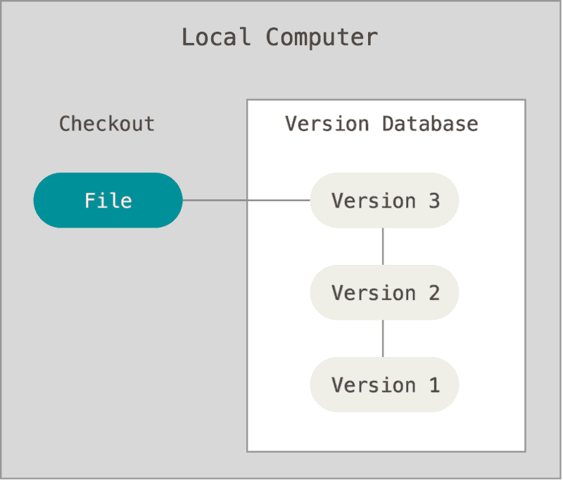
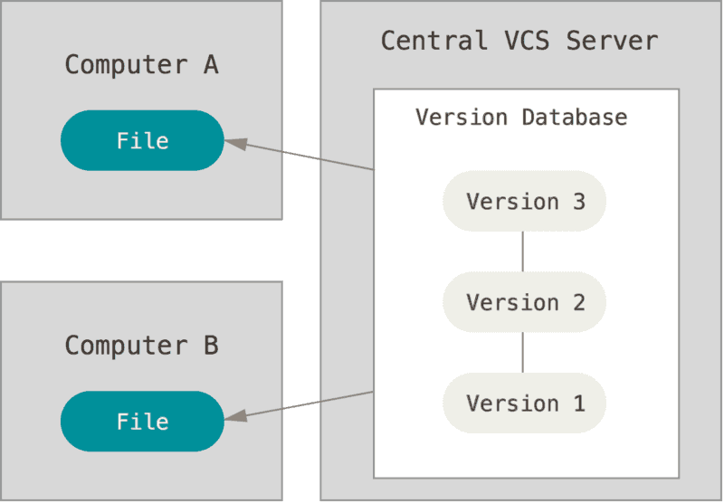
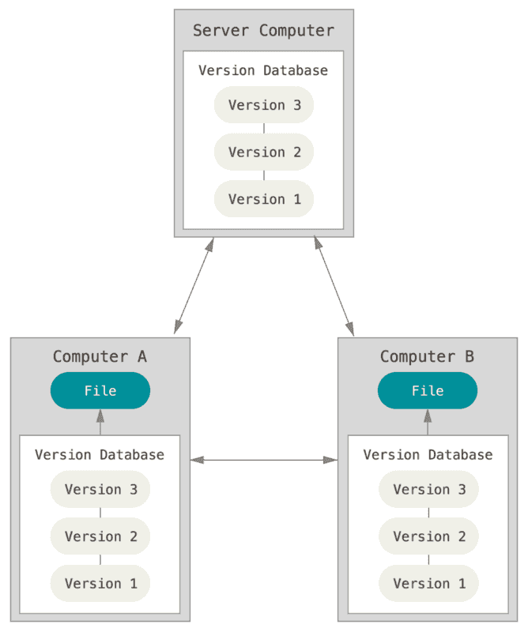
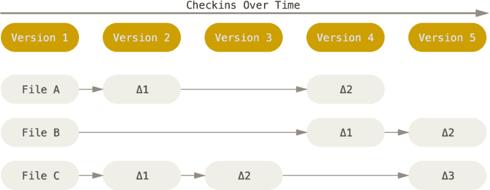
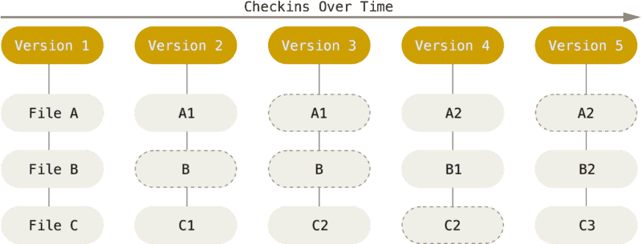
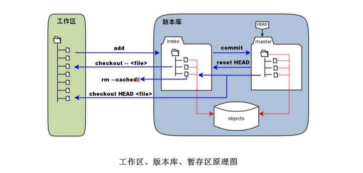
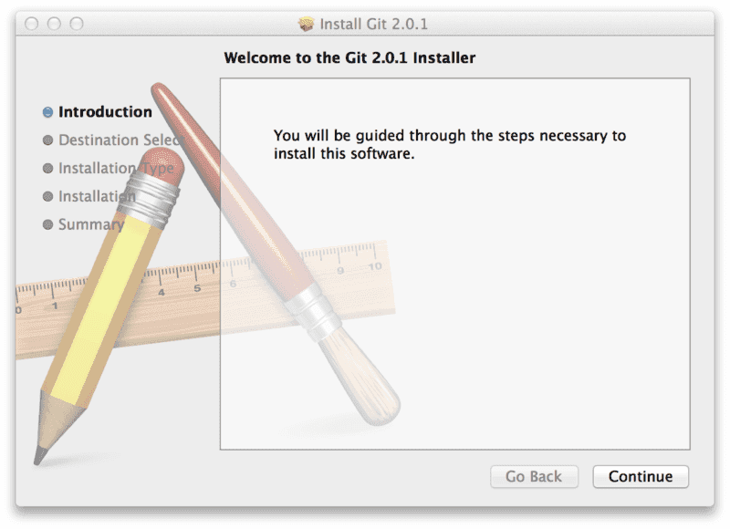

## 一、关于版本控制
***

版本控制是一种用来记录一个或若干文件内容的变化，以便将来可以查阅特定版本修订情况的系统。

在本教程所展示的例子中，我们对保存着软件源代码的文件作版本控制，但实际上，你可以对任何类型的文件进行版本控制。

#### 1. 本地版本控制系统
***

许多人习惯用复制整个项目目录的方式来保存不同的版本，或许还会改名加上备份时间以示区别。 这么做唯一的好处就是简单，但是特别容易犯错。

为了解决这个问题，人们很久以前就开发了许多种本地版本控制系统，大多都是采用某种简单的数据库来记录文件的历次更新差异。

其中最流行的一种叫做 RCS，现今许多计算机系统上都还看得到它的踪影。

#### 2. 集中化的版本控制系统
***

接下来人们又遇到一个问题，如何让在不同系统上的开发者协同工作？ 于是，集中化的版本控制系统（Centralized Version Control Systems，简称 CVCS）应运而生。

这类系统，诸如 CVS、Subversion 以及 Perforce 等，都有一个单一的集中管理的服务器，保存所有文件的修订版本，而协同工作的人们都通过客户端连到这台服务器，取出最新的文件或者提交更新。多年以来，这已成为版本控制系统的标准做法。

这种做法带来了许多好处，特别是相较于老式的本地 VCS 来说。 现在，每个人都可以在一定程度上看到项目中的其他人正在做些什么。 而管理员也可以轻松掌控每个开发者的权限，并且管理一个 CVCS 要远比在各个客户端上维护本地数据库来得轻松容易。

事分两面，有好有坏。 这么做最显而易见的缺点是中央服务器的单点故障。 如果宕机一小时，那么在这一小时内，谁都无法提交更新，也就无法协同工作。 如果中心数据库所在的磁盘发生损坏，又没有做恰当备份，毫无疑问你将丢失所有数据——包括项目的整个变更历史，只剩下人们在各自机器上保留的单独快照。 本地版本控制系统也存在类似问题，只要整个项目的历史记录被保存在单一位置，就有丢失所有历史更新记录的风险。

#### 3. 分布式版本控制系统
***

于是分布式版本控制系统（Distributed Version Control System，简称 DVCS）面世了。

在这类系统中，像 Git、Mercurial、Bazaar 以及 Darcs 等，客户端并不只提取最新版本的文件快照，而是把代码仓库完整地镜像下来。 这么一来，任何一处协同工作用的服务器发生故障，事后都可以用任何一个镜像出来的本地仓库恢复。 因为每一次的克隆操作，实际上都是一次对代码仓库的完整备份。

更进一步，许多这类系统都可以指定和若干不同的远端代码仓库进行交互。籍此，你就可以在同一个项目中，分别和不同工作小组的人相互协作。 你可以根据需要设定不同的协作流程，比如层次模型式的工作流，而这在以前的集中式系统中是无法实现的。

## 二、Git 简史
***
***

Linux 内核开源项目有着为数众广的参与者。
绝大多数的 Linux 内核维护工作都花在了提交补丁和保存归档的繁琐事务上（1991－2002年间）。
到 2002 年，整个项目组开始启用一个专有的分布式版本控制系统 BitKeeper 来管理和维护代码。

到了 2005 年，开发 BitKeeper 的商业公司同 Linux 内核开源社区的合作关系结束，他们收回了 Linux 内核社区免费使用 BitKeeper 的权力。这就迫使 Linux 开源社区（特别是 Linux 的缔造者 Linux Torvalds）基于使用 BitKcheper 时的经验教训，开发出自己的版本系统。

他们对新的系统制订了若干目标：

+ 速度
+ 简单的设计
+ 对非线性开发模式的强力支持（允许成千上万个并行开发的分支）
+ 完全分布式
+ 有能力高效管理类似 Linux 内核一样的超大规模项目（速度和数据量）

自诞生于 2005 年以来，Git 日臻成熟完善，在高度易用的同时，仍然保留着初期设定的目标。
它的速度飞快，极其适合管理大项目，有着令人难以置信的非线性分支管理系统。

## 三、 Git 基础
***
***

#### 1. 直接记录快照，而非差异比较
***

Git 和其它版本控制系统的主要差别在于 Git 对待数据的方法。 

其它大部分系统以文件变更列表的方式存储信息。 这类系统（CVS、Subversion、Perforce、Bazaar 等等）将它们保存的信息看作是一组基本文件和每个文件随时间逐步累积的差异。

Git 不按照以上方式对待或保存数据。反之，Git 更像是把数据看作是对小型文件系统的一组快照。每次你提交更新，或在 Git 中保存项目状态时，它主要对当时的全部文件制作一个快照并保存这个快照的索引。
为了高效，如果文件没有修改，Git 不再重新存储该文件，而是只保留一个链接指向之前存储的文件。

Git 对待数据更像是一个 **快照流**。

这是 Git 与几乎所有其它版本控制系统的重要区别。Git 更像是一个小型的文件系统，提供了许多以此为基础构建的超强工具，而不只是一个简单的 VCS。

#### 2. 近乎所有操作都是本地执行
***

在 Git 中的绝大多数操作都只需要访问本地文件和资源，一般不需要来自网络上其它计算机的信息。这也意味着你离线或者没有 VPN 时，几乎可以进行任何操作。 如你在飞机或火车上想做些工作，你能愉快地提交，直到有网络连接时再上传。 如你回家后 VPN 客户端不正常，你仍能工作。

#### 3. Git 保证完整性
***

Git 中所有数据在存储前都计算校验和，然后以校验和来引用。 这意味着不可能在 Git 不知情时更改任何文件内容或目录内容。 这个功能建构在 Git 底层，是构成 Git 哲学不可或缺的部分。 若你在传送过程中丢失信息或损坏文件，Git 就能发现。

Git 用以计算校验和的机制叫做 SHA-1 散列（hash，哈希）。这是一个由 40 个十六进制字符（0-9 和 a-f）组成字符串，基于 Git 中文件的内容或目录结构计算出来。

SHA-1 哈希看起来是这样：

    24b9da6552252987aa493b52f8696cd6d3b00373

实际上，Git 数据库中保存的信息都是以文件内容的哈希值来索引，而不是文件名。

#### 4. Git 一般只添加数据
***

你执行的 Git 操作，几乎只往 Git 数据库中增加数据。 很难让 Git 执行任何不可逆操作，或者让它以任何方式清除数据。

一旦你提交快照到 Git 中，就难以再丢失数据，特别是如果你定期的推送数据库到其它仓库的话。

#### 5. 三种状态
***

 **Git 有三种状态，你的文件可能处于其中之一：**

+ 已修改（modified）: 表示修改了文件，但还没保存到数据库中。
+ 已暂存（staged）: 表示对一个已修改文件的当前版本做了标记，使之包含在下次提交的快照中。
+ 已提交（committed）: 表示数据已经安全的保存在本地数据库中。

**由此引入 Git 项目的三个工作区域的概念：**

+ 工作目录
+ 暂存区域
+ Git 仓库(版本库)

工作目录是对项目的某个版本独立提取出来的内容。 这些从 Git 仓库的压缩数据库中提取出来的文件，放在磁盘上供你使用或修改。

暂存区域是一个文件，保存了下次将提交的文件列表信息，一般在 Git 仓库目录中。 有时候也被称作“索引”，不过一般说法还是叫暂存区域。

Git 仓库目录是 Git 用来保存项目的元数据和对象数据库的地方。 这是 Git 中最重要的部分，从其它计算机克隆仓库时，拷贝的就是这里的数据。

**基本的 Git 工作流程如下：**

1. 在工作目录中修改文件。
2. 暂存文件，将文件的快照放入暂存区域。
3. 提交更新，找到暂存区域的文件，将快照永久性存储到 Git 仓库目录。

如果作了修改并已放入暂存区域，就属于已暂存状态。 如果自上次取出后，作了修改但还没有放到暂存区域，就是已修改状态。如果 Git 目录中保存着的特定版本文件，就属于已提交状态。

## 四、 Git 安装
***
***

#### 1. 在 Linux 上安装
***
如果你想在 Linux 上用二进制安装程序来安装 Git，可以使用发行版包含的基础软件包管理工具来安装。 如果以 Fedora 上为例，你可以使用 yum：

     $ sudo yum install git

如果你在基于 Debian 的发行版上，请尝试用 apt-get：

     $ sudo apt-get install git

#### 2. 在 Mac 上安装
***

在 Mac 上安装 Git 有多种方式。
最简单的方法是安装 Xcode Command Line Tools。
Mavericks （10.9） 或更高版本的系统中，在 Terminal 里尝试首次运行 *git* 命令即可。
如果没有安装过命令行开发者工具，将会提示你安装。

如果你想安装更新的版本，可以使用二进制安装程序。
官方维护的 OSX Git 安装程序可以在 Git 官方网站下载，网址为 *http://git-scm.com/download/mac*。

你也可以将它作为 GitHub for Mac 的一部分来安装。
它们的图形化 Git 工具有一个安装命令行工具的选项。
你可以从 GitHub for Mac 网站下载该工具，网址为 *http://mac.github.com*。

#### 2. 在 Windows 上安装
***

在 Windows 上安装 Git 也有几种安装方法：

官方版本可以在 Git 官方网站下载。
打开 *http://git-scm.com/download/win*，下载会自动开始。

要注意这是一个名为 Git for Windows的项目（也叫做 msysGit），和 Git 是分别独立的项目；更多信息请访问 *http://msysgit.github.io/*。

另一个简单的方法是安装 GitHub for Windows。该安装程序包含图形化和命令行版本的 Git。它也能支持 Powershell，提供了稳定的凭证缓存和健全的 CRLF 设置。你可以在 GitHub for Windows 网站下载，网址为 *http://windows.github.com*。

## 五、 初次运行 Git 前的配置
***
***

既然已经在系统上安装了 Git，你会想要做几件事来定制你的 Git 环境。 每台计算机上只需要配置一次，程序升级时会保留配置信息。 你可以在任何时候再次通过运行命令来修改它们。

Git 自带一个 git config 的工具来帮助设置控制 Git 外观和行为的配置变量。

**这些变量存储在三个不同的位置：**

1. ** `/etc/gitconfig` 文件**: 包含系统上每一个用户及他们仓库的通用配置。如果使用带有--system选项的git config时，它会从此文件读写配置变量。

2. ** `~/.gitconfig` 或 `~/.config/git/config` 文件**：只针对当前用户。可以传递--global选项让 Git 读写此文件。

3. **当前使用仓库的 Git 目录中的 `config` 文件（就是 `.git/config` ）**：针对该仓库。

每一个级别覆盖上一级别的配置，所以 `.git/config` 的配置变量会覆盖 `/etc/gitconfig` 中的配置变量。

在 Windows 系统中，Git 会查找 `$HOME` 目录下（一般情况下是 `C:\Users\$USER` ）的 `.gitconfig` 文件。Git 同样也会寻找 `/etc/gitconfig` 文件，但只限于 MSys 的根目录下，即安装 Git 时所选的目标位置。

#### 1. 用户信息
***

当安装完 Git 应该做的第一件事就是设置你的用户名称与邮件地址。 这样做很重要，因为每一个 Git 的提交都会使用这些信息，并且它会写入到你的每一次提交中，不可更改：

    $ git config --global user.name "John Doe"
    $ git config --global user.email johndoe@example.com

再次强调，如果使用了 --global 选项，那么该命令只需要运行一次，因为之后无论你在该系统上做任何事情， Git 都会使用那些信息。 当你想针对特定项目使用不同的用户名称与邮件地址时，可以在那个项目目录下运行没有 --global 选项的命令来配置。

很多 GUI 工具都会在第一次运行时帮助你配置这些信息。

#### 2. 文本编辑器
***

既然用户信息已经设置完毕，你可以配置默认文本编辑器了，当 Git 需要你输入信息时会调用它。 如果未配置，Git 会使用操作系统默认的文本编辑器，通常是 Vim。 如果你想使用不同的文本编辑器，例如 Emacs，可以这样做：

    $ git config --global core.editor emacs

> **警告：**
> Vim 和 Emacs 是像 Linux 与 Mac 等基于 Unix 的系统上开发者经常使用的流行的文本编辑器。 如果你对这些编辑器都不是很了解或者你使用的是 Windows 系统，那么可能需要搜索如何在 Git 中配置你最常用的编辑器。 如果你不设置编辑器并且不知道 Vim 或 Emacs 是什么，当它们运行起来后你可能会被弄糊涂、不知所措。

#### 3. 检查配置信息
***

如果想要检查你的配置，可以使用 git config --list 命令来列出所有 Git 当时能找到的配置。

    $ git config --list
    user.name=John Doe
    user.email=johndoe@example.com
    color.status=auto
    color.branch=auto
    color.interactive=auto
    color.diff=auto
    ...

你可能会看到重复的变量名，因为 Git 会从不同的文件中读取同一个配置（例如：/etc/gitconfig 与 ~/.gitconfig）。 这种情况下，Git 会使用它找到的每一个变量的最后一个配置。

你可以通过输入 `git config <key>` ： 来检查 Git 的某一项配置

    $ git config user.name
    John Doe

## 六、 获取帮助

若你使用 Git 时需要获取帮助，有三种方法可以找到 Git 命令的使用手册：

    $ git help <verb>
    $ git <verb> --help
    $ man git-<verb>

例如，要想获得 config 命令的手册，执行

    $ git help config

现在，你应该已经对 Git 是什么、Git 与你可能正在使用的集中式版本控制系统有何区别等问题有了基本的了解。 现在，在你的个人系统中应该也有了一份能够工作的 Git 版本。 是时候开始学习本教程的第二部分有关 Git 的基础知识了。

> 本教程参照Git的官方文档编写，如有不明与错误之处，敬请指正。