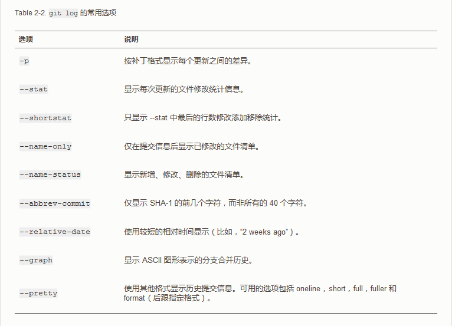

# 三、 查看提交历史

在提交了若干更新，又或者克隆了某个项目之后，你也许想回顾下提交历史. 完成这个任务最简单而又有效的工具是 `git log` 命令。

接下来的例子会用我专门用于演示的 simplegit 项目， 运行下面的命令获取该项目源代码：

    git clone https://github.com/schacon/simplegit-progit

然后在此项目中运行 `git log`，应该会看到下面的输出：

    $ git log
    commit ca82a6dff817ec66f44342007202690a93763949
    Author: Scott Chacon <schacon@gee-mail.com>
    Date:   Mon Mar 17 21:52:11 2008 -0700

        changed the version number

    commit 085bb3bcb608e1e8451d4b2432f8ecbe6306e7e7
    Author: Scott Chacon <schacon@gee-mail.com>
    Date:   Sat Mar 15 16:40:33 2008 -0700

        removed unnecessary test

    commit a11bef06a3f659402fe7563abf99ad00de2209e6
    Author: Scott Chacon <schacon@gee-mail.com>
    Date:   Sat Mar 15 10:31:28 2008 -0700

        first commit

默认不用任何参数的话，`git log` 会按提交时间列出所有的更新，最近的更新排在最上面。 正如你所看到的，这个命令会列出每个提交的 SHA-1 校验和、作者的名字和电子邮件地址、提交时间以及提交说明。

`git log` 有许多选项可以帮助你搜寻你所要找的提交， 接下来我们介绍些最常用的: 

1.一个常用的选项是 `-p`，用来显示每次提交的内容差异。 你也可以加上 `-2` 来仅显示最近两次提交：

    $ git log -p -2
    commit ca82a6dff817ec66f44342007202690a93763949
    Author: Scott Chacon <schacon@gee-mail.com>
    Date:   Mon Mar 17 21:52:11 2008 -0700

        changed the version number

    diff --git a/Rakefile b/Rakefile
    index a874b73..8f94139 100644
    --- a/Rakefile
    +++ b/Rakefile
    @@ -5,7 +5,7 @@ require 'rake/gempackagetask'
         spec = Gem::Specification.new do |s|
         s.platform  =   Gem::Platform::RUBY
         s.name      =   "simplegit"
    -    s.version   =   "0.1.0"
    +    s.version   =   "0.1.1"
         s.author    =   "Scott Chacon"
         s.email     =   "schacon@gee-mail.com"
         s.summary   =   "A simple gem for using Git in Ruby code."

    commit 085bb3bcb608e1e8451d4b2432f8ecbe6306e7e7
    Author: Scott Chacon <schacon@gee-mail.com>
    Date:   Sat Mar 15 16:40:33 2008 -0700

        removed unnecessary test

    diff --git a/lib/simplegit.rb b/lib/simplegit.rb
    index a0a60ae..47c6340 100644
    --- a/lib/simplegit.rb
    +++ b/lib/simplegit.rb
    @@ -18,8 +18,3 @@ class SimpleGit
         end

     end
    -
    -if $0 == __FILE__
    -  git = SimpleGit.new
    -  puts git.show
    -end
    \ No newline at end of file

该选项除了显示基本信息之外，还在附带了每次 commit 的变化。 当进行代码审查，或者快速浏览某个搭档提交的 commit 所带来的变化的时候，这个参数就非常有用了。 

2.你也可以为 `git log` 附带一系列的总结性选项。 比如说，如果你想看到每次提交的简略的统计信息，你可以使用 `--stat` 选项：

    $ git log --stat
    commit ca82a6dff817ec66f44342007202690a93763949
    Author: Scott Chacon <schacon@gee-mail.com>
    Date:   Mon Mar 17 21:52:11 2008 -0700

    changed the version number

     Rakefile | 2 +-
     1 file changed, 1 insertion(+), 1 deletion(-)

    commit 085bb3bcb608e1e8451d4b2432f8ecbe6306e7e7
    Author: Scott Chacon <schacon@gee-mail.com>
    Date:   Sat Mar 15 16:40:33 2008 -0700

        removed unnecessary test

     lib/simplegit.rb | 5 -----
     1 file changed, 5 deletions(-)

    commit a11bef06a3f659402fe7563abf99ad00de2209e6
    Author: Scott Chacon <schacon@gee-mail.com>
    Date:   Sat Mar 15 10:31:28 2008 -0700

        first commit

     README           |  6 ++++++
     Rakefile         | 23 +++++++++++++++++++++++
     lib/simplegit.rb | 25 +++++++++++++++++++++++++
     3 files changed, 54 insertions(+)

正如你所看到的，`--stat` 选项在每次提交的下面列出额所有被修改过的文件、有多少文件被修改了以及被修改过的文件的哪些行被移除或是添加了。 在每次提交的最后还有一个总结。

3.另外一个常用的选项是 `--pretty` 。 这个选项可以指定使用不同于默认格式的方式展示提交历史。 这个选项有一些内建的子选项供你使用。 比如用 `oneline` 将每个提交放在一行显示，查看的提交数很大时非常有用。 另外还有 `short`，`full` 和 `fuller` 可以用，展示的信息或多或少有些不同，请自己动手实践一下看看效果如何。

    $ git log --pretty=oneline
    ca82a6dff817ec66f44342007202690a93763949 changed the version number
    085bb3bcb608e1e8451d4b2432f8ecbe6306e7e7 removed unnecessary test
    a11bef06a3f659402fe7563abf99ad00de2209e6 first commit

4.但最有意思的是 `format`，可以定制要显示的记录格式。 这样的输出对后期提取分析格外有用 — 因为你知道输出的格式不会随着Git的更新而发生改变：

    $ git log --pretty=format:"%h - %an, %ar : %s"
    ca82a6d - Scott Chacon, 6 years ago : changed the version number
    085bb3b - Scott Chacon, 6 years ago : removed unnecessary test
    a11bef0 - Scott Chacon, 6 years ago : first commit

你一定奇怪 *作者* 和 *提交者* 之间究竟有何差别，
其实作者指的是实际作出修改的人，提交者指的是最后将此工作成果提交到仓库的人。
所以，当你为某个项目发布补丁，然后某个核心成员将你的补丁并入项目时，你就是作者，而那个核心成员就是提交者。

当 `oneline` 或 `format` 与另一个 log 选项 `--graph` 结合使用时尤其有用。 这个选项添加了一些ASCII字符串来形象地展示你的分支、合并历史：

    $ git log --pretty=format:"%h %s" --graph
    * 2d3acf9 ignore errors from SIGCHLD on trap
    *  5e3ee11 Merge branch 'master' of git://github.com/dustin/grit
    |\
    | * 420eac9 Added a method for getting the current branch.
    * | 30e367c timeout code and tests
    * | 5a09431 add timeout protection to grit
    * | e1193f8 support for heads with slashes in them
    |/
    * d6016bc require time for xmlschema
    *  11d191e Merge branch 'defunkt' into local

这种输出类型会在我们下一张学完分支与合并以后变得更加有趣。

以上只是简单介绍了一些git log命令支持的选项。
Table 2-2 列出了我们目前涉及到的和没涉及到的选项，已经它们是如何影响 log 命令的输出的：

# 四、撤消操作

## 1. 撤消操作
***

在任何一个阶段，你都有可能想要撤消某些操作。 这里，我们将会学习几个撤消你所做修改的基本工具。 注意，有些撤消操作是不可逆的。 这是在使用 Git 的过程中，会因为操作失误而导致之前的工作丢失的少有的几个地方之一。

有时候我们提交完了才发现漏掉了几个文件没有添加，或者提交信息写错了。 此时，可以运行带有 `--amend `选项的提交命令尝试重新提交：

    $ git commit --amend

这个命令会将暂存区中的文件提交。 如果自上次提交以来你还未做任何修改（例如，在上次提交后马上执行了此命令），那么快照会保持不变，而你所修改的只是提交信息。

文本编辑器启动后，可以看到之前的提交信息。 编辑后保存会覆盖原来的提交信息。

例如，你提交后发现忘记了暂存某些需要的修改，可以像下面这样操作：

    $ git commit -m 'initial commit'
    $ git add forgotten_file
    $ git commit --amend

最终你只会有一个提交 - 第二次提交将代替第一次提交的结果。

## 2. 取消暂存的文件
***

接下来的两个小节演示如何操作暂存区域与工作目录中已修改的文件。 这些命令在修改文件状态的同时，也会提示如何撤消操作。 例如，你已经修改了两个文件并且想要将它们作为两次独立的修改提交，但是却意外地输入了 `git add`  暂存了它们两个。 如何只取消暂存两个中的一个呢？ `git status`  命令提示了你：

    $ git add *
    $ git status
    On branch master
    Changes to be committed:
        (use "git reset HEAD <file>..." to unstage)

            renamed:    README.md -> README
            modified:   CONTRIBUTING.md

在 “Changes to be committed” 文字正下方，提示使用 `git reset HEAD <file>...` 来取消暂存。 所以，我们可以这样来取消暂存`CONTRIBUTING.md` 文件：

    $ git reset HEAD CONTRIBUTING.md
    Unstaged changes after reset:
    M   CONTRIBUTING.md
    $ git status
    On branch master
    Changes to be committed:
        (use "git reset HEAD <file>..." to unstage)

        renamed:    README.md -> README

    Changes not staged for commit:
        (use "git add <file>..." to update what will be committed)
        (use "git checkout -- <file>..." to discard changes in working directory)

            modified:   CONTRIBUTING.md

这个命令有点儿奇怪，但是起作用了。`CONTRIBUTING.md` 文件已经是修改未暂存的状态了。

## 3. 撤消对文件的修改
***

如果你并不想保留对 CONTRIBUTING.md 文件的修改怎么办？ 你该如何方便地撤消修改 - 将它还原成上次提交时的样子（或者刚克隆完的样子，或者刚把它放入工作目录时的样子）？ 幸运的是，git status 也告诉了你应该如何做。 在最后一个例子中，未暂存区域是这样：

    Changes not staged for commit:
        (use "git add <file>..." to update what will be committed)
        (use "git checkout -- <file>..." to discard changes in working directory)

            modified:   CONTRIBUTING.md

它非常清楚地告诉了你如何撤消之前所做的修改。 让我们来按照提示执行：

    $ git checkout -- CONTRIBUTING.md
    $ git status
    On branch master
    Changes to be committed:
        (use "git reset HEAD <file>..." to unstage)

        renamed:    README.md -> README

可以看到那些修改已经被撤消了。

你需要知道 `git checkout -- [file]` 是一个危险的命令，这很重要。 你对那个文件做的任何修改都会消失 - 你只是拷贝了另一个文件来覆盖它。 除非你确实清楚不想要那个文件了，否则不要使用这个命令。

记住，在 Git 中任何 *已提交的* 东西几乎总是可以恢复的。
甚至那些被删除的分支中的提交或使用 `--amend` 选项覆盖的提交也可以恢复。然而，任何你未提交的东西丢失后很可能再也找不到了。

> 本教程参照Git的官方文档编写，如有不明与错误之处，敬请指正。