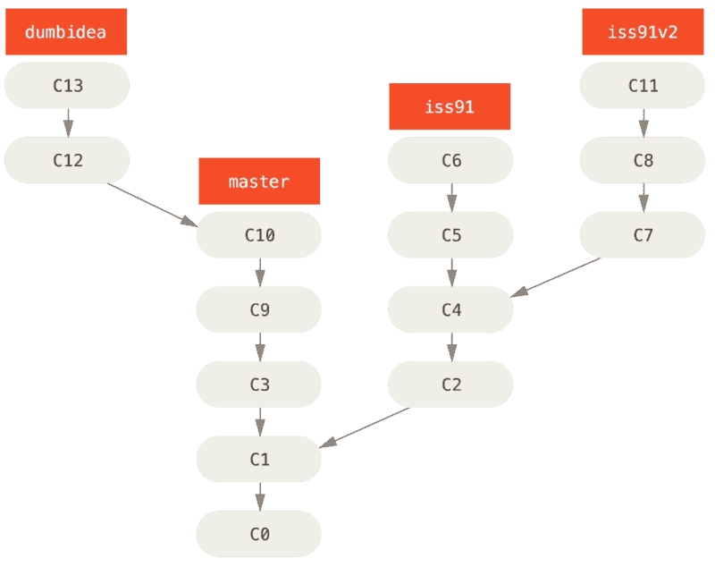
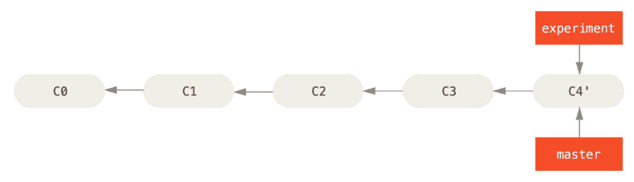

# 四、 分支开发工作流

现在你已经学会新建和合并分支，那么你可以或者应该用它来做些什么呢？ 在本节，我们会介绍一些常见的利用分支进行开发的工作流程。而正是由于分支管理的便捷，才衍生出这些典型的工作模式，你可以根据项目实际情况选择一种用用看。

## 1. 长期分支
***

因为 Git 使用简单的三方合并，所以就算在一段较长的时间内，反复把一个分支合并入另一个分支，也不是什么难事。 也就是说，在整个项目开发周期的不同阶段，你可以同时拥有多个开放的分支；你可以定期地把某些特性分支合并入其他分支中。

许多使用 Git 的开发者都喜欢使用这种方式来工作，比如只在 master 分支上保留完全稳定的代码——有可能仅仅是已经发布或即将发布的代码。 他们还有一些名为 develop 或者 next 的平行分支，被用来做后续开发或者测试稳定性——这些分支不必保持绝对稳定，但是一旦达到稳定状态，它们就可以被合并入 master 分支了。 这样，在确保这些已完成的特性分支（短期分支，比如之前的 iss53 分支）能够通过所有测试，并且不会引入更多 bug 之后，就可以合并入主干分支中，等待下一次的发布。

事实上我们刚才讨论的，是随着你的提交而不断右移的指针。 稳定分支的指针总是在提交历史中落后一大截，而前沿分支的指针往往比较靠前。

通常把他们想象成流水线（work silos）可能更好理解一点，那些经过测试考验的提交会被遴选到更加稳定的流水线上去。

你可以用这种方法维护不同层次的稳定性。 一些大型项目还有一个 proposed（建议） 或 pu: proposed updates（建议更新）分支，它可能因包含一些不成熟的内容而不能进入 next 或者 master 分支。 这么做的目的是使你的分支具有不同级别的稳定性；当它们具有一定程度的稳定性后，再把它们合并入具有更高级别稳定性的分支中。 再次强调一下，使用多个长期分支的方法并非必要，但是这么做通常很有帮助，尤其是当你在一个非常庞大或者复杂的项目中工作时。

## 2. 特性分支
***

特性分支对任何规模的项目都适用。 特性分支是一种短期分支，它被用来实现单一特性或其相关工作。 也许你从来没有在其他的版本控制系统（VCS）上这么做过，因为在那些版本控制系统中创建和合并分支通常很费劲。 然而，在 Git 中一天之内多次创建、使用、合并、删除分支都很常见。

你已经在上一节中你创建的 iss53 和 hotfix 特性分支中看到过这种用法。 你在上一节用到的特性分支（iss53 和 hotfix 分支）中提交了一些更新，并且在它们合并入主干分支之后，你又删除了它们。 这项技术能使你快速并且完整地进行上下文切换（context-switch）——因为你的工作被分散到不同的流水线中，在不同的流水线中每个分支都仅与其目标特性相关，因此，在做代码审查之类的工作的时候就能更加容易地看出你做了哪些改动。 你可以把做出的改动在特性分支中保留几分钟、几天甚至几个月，等它们成熟之后再合并，而不用在乎它们建立的顺序或工作进度。

考虑这样一个例子，你在 master 分支上工作到 C1，这时为了解决一个问题而新建 iss91 分支，在 iss91 分支上工作到 C4，然而对于那个问题你又有了新的想法，于是你再新建一个 iss91v2 分支试图用另一种方法解决那个问题，接着你回到 master 分支工作了一会儿，你又冒出了一个不太确定的想法，你便在 C10 的时候新建一个 dumbidea 分支，并在上面做些实验。 你的提交历史看起来像下面这个样子：

现在，我们假设两件事情：你决定使用第二个方案来解决那个问题，即使用在 iss91v2 分支中方案；另外，你将 dumbidea 分支拿给你的同事看过之后，结果发现这是个惊人之举。 这时你可以抛弃 iss91 分支（即丢弃 C5 和 C6 提交），然后把另外两个分支合并入主干分支。 最终你的提交历史看起来像下面这个样子：

我们将会在 分布式 Git 中向你揭示更多有关分支工作流的细节，因此，请确保你阅读完那个章节之后，再来决定你的下个项目要使用什么样的分支策略（branching scheme）。

请牢记，当你做这么多操作的时候，这些分支全部都存于本地。
当你新建和合并分支的时候，所有这一切都只发生在你本地的 Git 版本库中 —— 没有与服务器发生交互。

# 五、 远程分支

## 1.  远程分支
***

远程引用是对远程仓库的引用（指针），包括分支、标签等等。 你可以通过 `git ls-remote (remote)` 来显式地获得远程引用的完整列表，或者通过 `git remote show (remote)` 获得远程分支的更多信息。 然而，一个更常见的做法是利用远程跟踪分支。

远程跟踪分支是远程分支状态的引用。 它们是你不能移动的本地引用，当你做任何网络通信操作时，它们会自动移动。 远程跟踪分支像是你上次连接到远程仓库时，那些分支所处状态的书签。

它们以 (remote)/(branch) 形式命名。 例如，如果你想要看你最后一次与远程仓库 origin 通信时 master 分支的状态，你可以查看 origin/master 分支。 你与同事合作解决一个问题并且他们推送了一个 iss53 分支，你可能有自己的本地 iss53 分支；但是在服务器上的分支会指向 origin/iss53 的提交。

这可能有一点儿难以理解，让我们来看一个例子。 假设你的网络里有一个在 git.ourcompany.com 的 Git 服务器。 如果你从这里克隆，Git 的 `clone` 命令会为你自动将其命名为 origin，拉取它的所有数据，创建一个指向它的 master 分支的指针，并且在本地将其命名为 origin/master。 Git 也会给你一个与 origin 的 master 分支在指向同一个地方的本地 master 分支，这样你就有工作的基础。

注：
**“origin” 并无特殊含义**
远程仓库名字 “origin” 与分支名字 “master” 一样，在 Git 中并没有任何特别的含义一样。 同时 “master” 是当你运行 `git init` 时默认的起始分支名字，原因仅仅是它的广泛使用，“origin” 是当你运行 `git clone` 时默认的远程仓库名字。 如果你运行 `git clone -o booyah`，那么你默认的远程分支名字将会是 “booyah/master”。

如果你在本地的 master 分支做了一些工作，然而在同一时间，其他人推送提交到 git.ourcompany.com 并更新了它的 master 分支，那么你的提交历史将向不同的方向前进。 也许，只要你不与 origin 服务器连接，你的 origin/master 指针就不会移动。

如果要同步你的工作，运行 `git fetch origin` 命令。 这个命令查找 origin 是哪一个服务器（在本例中，它是 git.ourcompany.com），从中抓取本地没有的数据，并且更新本地数据库，移动 origin/master 指针指向新的、更新后的位置。

为了演示有多个远程仓库与远程分支的情况，我们假定你有另一个内部 Git 服务器，仅用于你的 sprint 小组的开发工作。
这个服务器位于git.team1.ourcompany.com。你可以运行`git remote add` 命令添加一个新的远程仓库引用到当前的项目，这个命令我们会在 Git 基础 中详细说明。将这个远程仓库命名为 teamone，将其作为整个 URL 的缩写。

现在，可以运行 `git fetch teamone` 来抓取远程仓库 teamone 有而本地没有的数据。 因为那台服务器上现有的数据是 origin 服务器上的一个子集，所以 Git 并不会抓取数据而是会设置远程跟踪分支 teamone/master 指向 teamone 的 master 分支。

## 2. 推送
***

当你想要公开分享一个分支时，需要将其推送到有写入权限的远程仓库上。 本地的分支并不会自动与远程仓库同步 - 你必须显式地推送想要分享的分支。 这样，你就可以把不愿意分享的内容放到私人分支上，而将需要和别人协作的内容推送到公开分支。

如果希望和别人一起在名为 serverfix 的分支上工作，你可以像推送第一个分支那样推送它。 运行 `git push (remote) (branch)` :

    $ git push origin serverfix
    Counting objects: 24, done.
    Delta compression using up to 8 threads.
    Compressing objects: 100% (15/15), done.
    Writing objects: 100% (24/24), 1.91 KiB | 0 bytes/s, done.
    Total 24 (delta 2), reused 0 (delta 0)
    To https://github.com/schacon/simplegit
     * [new branch]      serverfix -> serverfix

这里有些工作被简化了。Git 自动将 serverfix 
分支名字展开为refs/heads/serverfix:refs/heads/serverfix，那意味着，“推送本地的 serverfix 分支来更新远程仓库上的 serverfix 分支。”我们将会详细学习 Git 内部原理 的 refs/heads/ 部分，但是现在可以先把它放在儿。你也可以运行 git push origin serverfix:serverfix，它会做同样的事 - 相当于它说，“推送本地的 erverfix 分支，将其作为远程仓库的 serverfix 分支”可以通过这种格式来推送本地分支到一个命名不相同的远程分支。如果并不想让远程仓库上的分支叫做serverfix，可以运行 `git push origin serverfix:awesomebranch` 来将本地的 serverfix 分支推送到远程仓库上的 awesomebranch 分支。

注： **如何避免每次输入密码**
如果你正在使用 HTTPS URL 来推送，Git 服务器会询问用户名与密码。默认情况下它会在终端中提示服务器是否允许你进行推送。
如果不想在每一次推送时都输入用户名与密码，你可以设置一个 “credential cache”。最简单的方式就是将其保存在内存中几分钟，可以简单地运行 `git config --global credential.helper cache` 来设置它。
想要了解更多关于不同验证缓存的可用选项，查看 凭证存储。

下一次其他协作者从服务器上抓取数据时，他们会在本地生成一个远程分支 origin/serverfix，指向服务器的 serverfix 分支的引用：

    $ git fetch origin
    remote: Counting objects: 7, done.
    remote: Compressing objects: 100% (2/2), done.
    remote: Total 3 (delta 0), reused 3 (delta 0)
    Unpacking objects: 100% (3/3), done.
    From https://github.com/schacon/simplegit
     * [new branch]      serverfix    -> origin/serverfix

要特别注意的一点是当抓取到新的远程跟踪分支时，本地不会自动生成一份可编辑的副本（拷贝）。 换一句话说，这种情况下，不会有一个新的 serverfix 分支 - 只有一个不可以修改的 origin/serverfix 指针。

可以运行 `git merge origin/serverfix` 将这些工作合并到当前所在的分支。 如果想要在自己的 serverfix 分支上工作，可以将其建立在远程跟踪分支之上：

    $ git checkout -b serverfix origin/serverfix
    Branch serverfix set up to track remote branch serverfix from origin.
    Switched to a new branch 'serverfix'

这会给你一个用于工作的本地分支，并且起点位于 `origin/serverfix` 。

**Debug：** *解决github push错误The requested URL returned error: 403 Forbidden while accessing*

github push错误：

    error: The requested URL returned error: 403 Forbidden while accessing https://github.com/changdapeng/zhuiyinggu.git/info/refs

解决方案：
修改

    [remote "origin"]
        fetch = +refs/heads/*:refs/remotes/origin/*
        url = https://github.com/changdapeng/zhuiyinggu.git

为：

    [remote "origin"]
        fetch = +refs/heads/*:refs/remotes/origin/*
        url = https://changdapeng@github.com/changdapeng/zhuiyinggu.git

然后重新push输入密码即可
  

## 3. 跟踪分支
***

从一个远程跟踪分支检出一个本地分支会自动创建一个叫做 “跟踪分支”（有时候也叫做 “上游分支”）。 跟踪分支是与远程分支有直接关系的本地分支。 如果在一个跟踪分支上输入 `git pull`，Git 能自动地识别去哪个服务器上抓取、合并到哪个分支。

当克隆一个仓库时，它通常会自动地创建一个跟踪 origin/master 的 master 分支。 然而，如果你愿意的话可以设置其他的跟踪分支 - 其他远程仓库上的跟踪分支，或者不跟踪 master 分支。 最简单的就是之前看到的例子，运行 `git checkout -b [branch] [remotename]/[branch]`。 这是一个十分常用的操作所以 Git 提供了 `--track` 快捷方式：

    $ git checkout --track origin/serverfix
    Branch serverfix set up to track remote branch serverfix from origin.
    Switched to a new branch 'serverfix'

如果想要将本地分支与远程分支设置为不同名字，你可以轻松地增加一个不同名字的本地分支的上一个命令：

    $ git checkout -b sf origin/serverfix
    Branch sf set up to track remote branch serverfix from origin.
    Switched to a new branch 'sf'

现在，本地分支 sf 会自动从 origin/serverfix 拉取。

设置已有的本地分支跟踪一个刚刚拉取下来的远程分支，或者想要修改正在跟踪的上游分支，你可以在任意时间使用 `-u` 或 `--set-upstream-to` 选项运行 `git branch` 来显式地设置。

    $ git branch -u origin/serverfix
    Branch serverfix set up to track remote branch serverfix from origin.

注：
**上游快捷方式**
当设置好跟踪分支后，可以通过 `@{upstream}` 或 `@{u}` 快捷方式来引用它。 所以在 master 分支时并且它正在跟踪 origin/master 时，如果愿意的话可以使用 `git merge @{u}` 来取代 `git merge origin/master`。

如果想要查看设置的所有跟踪分支，可以使用 `git branch` 的 `-vv` 选项。 这会将所有的本地分支列出来并且包含更多的信息，如每一个分支正在跟踪哪个远程分支与本地分支是否是领先、落后或是都有。

    $ git branch -vv
      iss53     7e424c3 [origin/iss53: ahead 2] forgot the brackets
      master    1ae2a45 [origin/master] deploying index fix
    * serverfix f8674d9 [teamone/server-fix-good: ahead 3, behind 1] this should do it
      testing   5ea463a trying something new

这里可以看到 iss53 分支正在跟踪 origin/iss53 并且 “ahead” 是 2，意味着本地有两个提交还没有推送到服务器上。 也能看到 master 分支正在跟踪 origin/master 分支并且是最新的。 接下来可以看到 serverfix 分支正在跟踪 teamone 服务器上的 server-fix-good 分支并且领先 2 落后 1，意味着服务器上有一次提交还没有合并入同时本地有三次提交还没有推送。 最后看到 testing 分支并没有跟踪任何远程分支。

需要重点注意的一点是这些数字的值来自于你从每个服务器上最后一次抓取的数据。 这个命令并没有连接服务器，它只会告诉你关于本地缓存的服务器数据。 如果想要统计最新的领先与落后数字，需要在运行此命令前抓取所有的远程仓库。 可以像这样做：

    $ git fetch --all; git branch -vv

## 4. 拉取
***

当 `git fetch` 命令从服务器上抓取本地没有的数据时，它并不会修改工作目录中的内容。 它只会获取数据然后让你自己合并。 然而，有一个命令叫作 `git pull` 在大多数情况下它的含义是一个 `git fetch` 紧接着一个 `git merge` 命令。 如果有一个像之前章节中演示的设置好的跟踪分支，不管它是显式地设置还是通过 `clone` 或 `checkout` 命令为你创建的，`git pull` 都会查找当前分支所跟踪的服务器与分支，从服务器上抓取数据然后尝试合并入那个远程分支。

由于 `git pull` 的魔法经常令人困惑所以通常单独显式地使用 `fetch` 与 `merge` 命令会更好一些。

## 5. 删除远程分支
***

假设你已经通过远程分支做完所有的工作了 - 也就是说你和你的协作者已经完成了一个特性并且将其合并到了远程仓库的 master 分支（或任何其他稳定代码分支）。 可以运行带有 `--delete` 选项的 `git push` 命令来删除一个远程分支。 如果想要从服务器上删除 serverfix 分支，运行下面的命令：

    $ git push origin --delete serverfix
    To https://github.com/schacon/simplegit
     - [deleted]         serverfix

基本上这个命令做的只是从服务器上移除这个指针。 Git 服务器通常会保留数据一段时间直到垃圾回收运行，所以如果不小心删除掉了，通常是很容易恢复的。

# 六、变基

在 Git 中整合来自不同分支的修改主要有两种方法：`merge` 以及 `rebase`。 在本节中我们将学习什么是“变基”，怎样使用“变基”，并将展示该操作的惊艳之处，以及指出在何种情况下你应避免使用它。

## 1. 变基的基本操作
***

请回顾之前在 分支的合并 中的一个例子，你会看到开发任务分叉到两个不同分支，又各自提交了更新。

之前介绍过，整合分支最容易的方法是 `merge` 命令。 它会把两个分支的最新快照（C3 和 C4）以及二者最近的共同祖先（C2）进行三方合并，合并的结果是生成一个新的快照（并提交）。

其实，还有一种方法：你可以提取在C4中引入的补丁和修改，然后在C3的基础上再应用一次。在 Git 中，这种操作就叫做 *变基*。你可以使用 `rebase` 命令将提交到某一分支上的所有修改都移至另一分支上，就好像“重新播放”一样。

在上面这个例子中，运行：

    $ git checkout experiment
    $ git rebase master
    First, rewinding head to replay your work on top of it...
    Applying: added staged command

它的原理是首先找到这两个分支（即当前分支 experiment、变基操作的目标基底分支 master）的最近共同祖先 C2，然后对比当前分支相对于该祖先的历次提交，提取相应的修改并存为临时文件，然后将当前分支指向目标基底 C3, 最后以此将之前另存为临时文件的修改依序应用。（译注：写明了 commit id，以便理解，下同）

现在回到 master 分支，进行一次快进合并。

    $ git checkout master
    $ git merge experiment

此时，C4' 指向的快照就和上面使用 `merge` 命令的例子中 C5 指向的快照一模一样了。 这两种整合方法的最终结果没有任何区别，但是变基使得提交历史更加整洁。 你在查看一个经过变基的分支的历史记录时会发现，尽管实际的开发工作是并行的，但它们看上去就像是先后串行的一样，提交历史是一条直线没有分叉。

一般我们这样做的目的是为了确保在向远程分支推送时能保持提交历史的整洁——例如向某个别人维护的项目贡献代码时。 在这种情况下，你首先在自己的分支里进行开发，当开发完成时你需要先将你的代码变基到 origin/master 上，然后再向主项目提交修改。 这样的话，该项目的维护者就不再需要进行整合工作，只需要快进合并便可。

请注意，无论是通过变基，还是通过三方合并，整合的最终结果所指向的快照始终是一样的，只不过提交历史不同罢了。 变基是将一系列提交按照原有次序依次应用到另一分支上，而合并是把最终结果合在一起。

## 2. 更有趣的变基例子
***

在对两个分支进行变基时，所生成的“重演”并不一定要在目标分支上应用，你也可以指定另外的一个分支进行应用。就像 Figure 3-31 中的例子这样。你创建了一个特性分支 server，为服务端添加了一些功能，提交了 C3 和 C4 。然后从 C3 上创建了特性分支 client，为客户端添加了一些功能，提交了 C8 和 C9 。最后，你回到 server 分支，又提交了 C10。

假设你希望将 client 中的修改合并到主分支并发布，但暂时并不想合并 server 中的修改，因为它们还需要经过更全面的测试。 这时，你就可以使用 `git rebase` 命令的 `--onto` 选项，选中在 client 分支里但不在 server 分支里的修改（即 C8 和 C9），将它们在 master 分支上重演：

    $ git rebase --onto master server client

以上命令的意思是：“取出 client 分支，找出处于 client 分支和 server 分支的共同祖先之后的修改，然后把它们在 master 分支上重演一遍”。 这理解起来有一点复杂，不过效果非常酷。

现在可以快进合并 master 分支了。

    $ git checkout master
    $ git merge client

接下来你决定将 server 分支中的修改也整合进来。 使用 `git rebase [basebranch] [topicbranch]` 命令可以直接将特性分支（即本例中的 server）变基到目标分支（即 master）上。这样做能省去你先切换到 server 分支，再对其执行变基命令的多个步骤。

    $ git rebase master server

server中的代码被“续”到了 master 后面。

然后就可以快进合并主分支 master 了：

    $ git checkout master
    $ git merge server

至此，client和server分支中的修改都已经整合到主分支里去了，你可以删除这两个分支，最终提交历史会变成图 Figure 3-35 中的样子：

    $ git branch -d client
    $ git branch -d server

## 2. 变基的风险

呃，奇妙的变基也并非完美无缺，要用它得遵守一条准则：

**不要对在你的仓库外有副本的分支执行变基。**

如果你遵循这条金科玉律，就不会出差错。
否则，人民群众会仇恨你，你的朋友和家人也会嘲笑你，唾弃你。

变基操作的实质是丢弃一些现有的提交，然后相应地新建一些内容一样但实际上不同的提交。
如果你已经将提交推送至某个仓库，而其他人也已经从该仓库拉取提交并进行了后续工作，此时，如果你用 `git rebase` 命令重新整理了提交并再次推送，你的同伴因此将不得不再次将他们手头的工作与你的提交进行整合，如果接下来你还要拉取并整合他们修改过的提交，事情就会变得一团糟。

让我们来看一个在公开的仓库上执行变基操作所带来的问题。假设你从一个中央服务器克隆然后在它的基础上进行了一些开发。你的提交历史如图所示：

然后，某人又向中央服务器提交了一些修改，其中还包括一次合并。 你抓取了这些在远程分支上的修改，并将其合并到你本地的开发分支，然后你的提交历史就会变成这样：

接下来，这个人又决定把合并操作回滚，改用变基；继而又用 `git push --force` 命令覆盖了服务器上的提交历史。 之后你从服务器抓取更新，会发现多出来一些新的提交。

结果就是你们两人的处境都十分尴尬。 如果你执行 `git pull` 命令，你将合并来自两条提交历史的内容，生成一个新的合并提交，最终仓库会如图所示：

此时如果你执行 `git log` 命令，你会发现有两个提交的作者、日期、日志居然是一样的，这会令人感到混乱。 此外，如果你将这一堆又推送到服务器上，你实际上是将那些已经被变基抛弃的提交又找了回来，这会令人感到更加混乱。 很明显对方并不想在提交历史中看到 C4 和 C6，因为之前就是他们把这两个提交通过变基丢弃的。

## 3. 用变基解决变基
***

如果你 **真的** 遭遇了类似的处境，Git 还有一些高级魔法可以帮到你。
如果团队中的某人强制推送并覆盖了一些你所基于的提交，你需要做的就是检查你做了哪些修改，以及他们覆盖了哪些修改。

实际上，Git 除了对整个提交计算 SHA-1 校验和以外，也对本次提交所引入的修改计算了校验和——
即 “patch-id”。

如果你拉取被覆盖过的更新并将你手头的工作基于此进行变基的话，一般情况下 Git 都能成功分辨出哪些是你的修改，并把它们应用到新分支上。

举个例子，如果遇到前面提到的 Figure 3-38 那种情境，如果我们不是执行合并，而是执行 `git rebase teamone/master`, Git 将会：

+ 检查哪些提交是我们的分支上独有的（C2，C3，C4，C6，C7）
+ 检查其中哪些提交不是合并操作的结果（C2，C3，C4）
+ 检查哪些提交在对方覆盖更新时并没有被纳入目标分支（只有 C2 和 C3，因为 C4 其实就是 C4'）
+ 把查到的这些提交应用在 teamone/master 上面

从而我们将得到与 Figure 3-39 中不同的结果，如图 Figure 3-40 所示。

要想上述方案有效，还需要对方在变基时确保 C4' 和 C4 是几乎一样的。 否则变基操作将无法识别，并新建另一个类似 C4 的补丁（而这个补丁很可能无法整洁的整合入历史，因为补丁中的修改已经存在于某个地方了）。

在本例中另一种简单的方法是使用 `git pull --rebase` 命令而不是直接 `git pull`。 又或者你可以自己手动完成这个过程，先 `git fetch`，再 `git rebase teamone/master` 。

如果你习惯使用 `git pull` ，同时又希望默认使用选项 `--rebase`，你可以执行这条语句 `git config --global pull.rebase true` 来更改 `pull.rebase` 的默认配置。

只要你把变基命令当作是在推送前清理提交使之整洁的工具，并且只在从未推送至共用仓库的提交上执行变基命令，你就不会有事。 假如你在那些已经被推送至共用仓库的提交上执行变基命令，并因此丢弃了一些别人的开发所基于的提交，那你就有大麻烦了，你的同事也会因此鄙视你。

如果你或你的同事在某些情形下决意要这么做，请一定要通知每个人执行 `git pull --rebase` 命令，这样尽管不能避免伤痛，但能有所缓解。

## 4. 变基 vs. 合并
***

至此，你已在实战中学习了变基和合并的用法，你一定会想问，到底哪种方式更好。
在回答这个问题之前，让我们退后一步，想讨论一下提交历史到底意味着什么。

有一种观点认为，仓库的提交历史即是 **记录实际发生过什么**。
它是针对历史的文档，本身就有价值，不能乱改。
从这个角度看来，改变提交历史是一种亵渎，你使用*谎言*掩盖了实际发生过的事情。
如果由合并产生的提交历史是一团糟怎么办？
既然事实就是如此，那么这些痕迹就应该被保留下来，让后人能够查阅。

另一种观点则正好相反，他们认为提交历史是 **项目过程中发生的故事**。
没人会出版一本书的第一批草稿，软件维护手册也是需要反复修订才能方便使用。
持这一观点的人会使用 rebase 及 filter-branch 等工具来编写故事，怎么方便后来的读者就怎么写。

现在，让我们回到之前的问题上来，到底合并还是变基好？希望你能明白，并没有一个简单的答案。
Git 是一个非常强大的工具，它允许你对提交历史做许多事情，但每个团队、每个项目对此的需求并不相同。
既然你已经分别学习了两者的用法，相信你能够根据实际情况作出明智的选择。

总的原则是，只对尚未推送或分享给别人的本地修改执行变基操作清理历史，从不对已推送至别处的提交执行变基操作，这样，你才能享受到两种方式带来的便利。

我们已经讲完了 Git 分支与合并的基础知识。 你现在应该能自如地创建并切换至新分支、在不同分支之间切换以及合并本地分支。 你现在应该也能通过推送你的分支至共享服务以分享它们、使用共享分支与他人协作以及在共享之前使用变基操作合并你的分支。

> 本教程参照Git的官方文档编写，如有不明与错误之处，敬请指正。