## 导读：
Markdown 是一种轻量级的**标记语言**，它的语法简洁但又能显示出规范整洁的效果，让我们可以更专注于写作而不是调整繁杂的格式。Markdown的目标是实现「易读易写」。

由于Markdown被保存为以`.md`格式结尾的纯文本文件，所以文件本身并没有复杂的排版格式，用简单的文本编辑器就可以编辑。由于各个平台的良好文本编辑器的支持，现在正被越来越多的写作爱好者、程序员使用。

Markdown 的语法十分简单。常用的标记符号也不超过十个，学习成本不需要太多，且一旦熟悉这种语法规则，会有一劳永逸的效果。

## 一、安装Markdown Chrome插件

在Mac上 有 Mou、Ulysees Ⅲ、iA Writer、Byword等编辑器，Mac用户请自行选择安装。
Windows平台上并没有找到简洁好用的编辑器，所以我的写作环境就是用普通的文本编辑器写作，用Chrome浏览器的Markdown Preview Plus 插件来浏览和导出PDF等格式。

Markdown Preview Plus百度网盘的分享链接：
[Markdown Preview Plus 链接](http://pan.baidu.com/s/1o76zGwE)
密码：k2fr

安装完成后的效果：

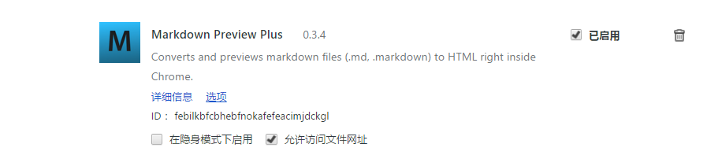

你可以这样设置显示样式：

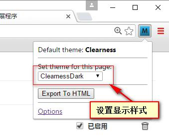

你可以这样导出PDF格式：

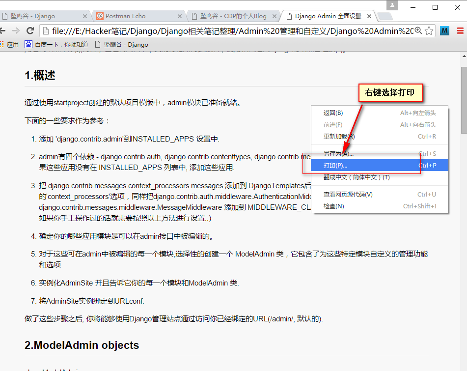

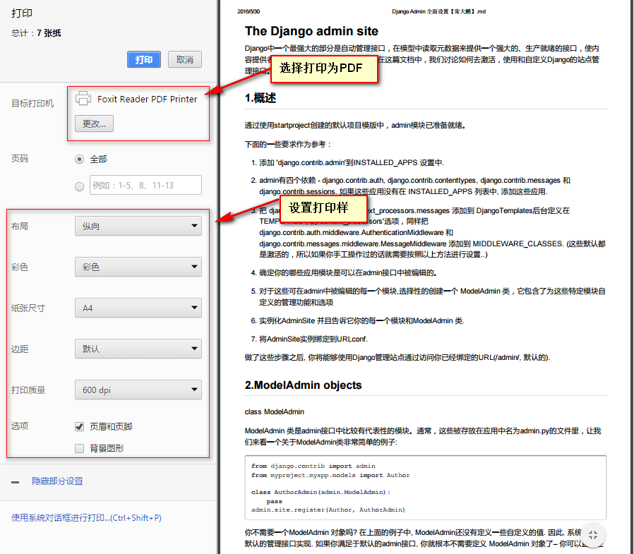

## 二、Markdown语法简要说明

#### 1.段落和换行

一个 Markdown 段落是由一个或多个连续的文本行组成，它的前后要有一个以上的空行（空行的定义是显示上看起来像是空的，便会被视为空行。比方说，若某一行只包含空格和制表符，则该行也会被视为空行）。
普通段落不该用空格或制表符来缩进。

##### 2.标题

标题是每篇文章都需要也是最常用的格式，在Markdown中，可以在一段文字前面加`#`号（建议在井号后面加一个空格，这是最为标准的语法），来定义这段文字为标题。在Markdown中一共有六级标题，几级标题就加几个井号：

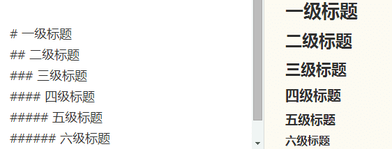

##### 3.粗体与斜体

Markdown中用两个`*`包含一段文本就为粗体，用一个`*`包含一段文本就为斜体：

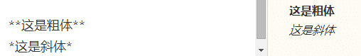

#### 4.图片和链接

Markdown中插入图片和链接的语法很像，只差一个`!`号：
图片为：``
[]中为图片的名称，()中为图片的链接

链接为：``
[]中为链接显示的文本，()中为设置的链接

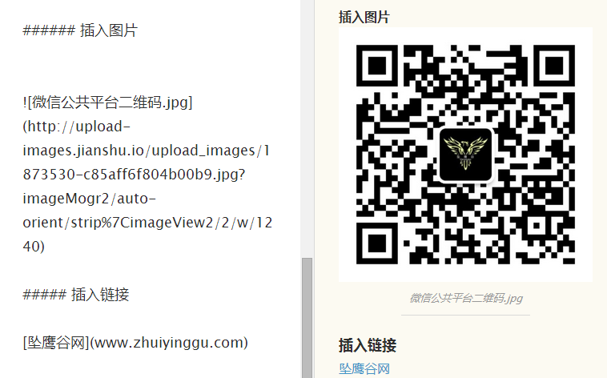

#### 5.代码框

如果你是一个程序员，在Markdown中插入代码将变得非常简单：

在文本中插入代码只需要用两个 ` 号把中间的代码引起来。

如果你要单独的插入一段代码，把整段代码用`tab`键缩进即可（建议在代码框上下各空出两行，保证显示效果的正确性）

在文本中插入代码`print ("hello CDP")`在文本中插入代码

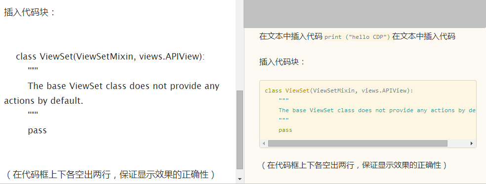

#### 6.分割线

在Markdown中插入分割线只需要三个 `*`号就行。

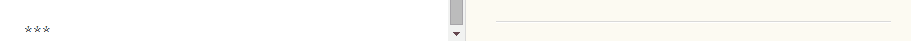

#### 7.列表

在Markdown中可以插入两种形式的列表：

无序列表：在文字前面加 `+` 或 `-` 或  `*` 并附带一个空格。

有序列表：在文字前面加 `1.` `2.` `3.` ，并附带一个空格就行。

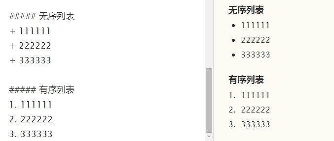

#### 8.引用

在Markdown中，如果你想引用别处的一小段文字并使用引用格式的话，在这段文字的前面加 `>` 号（大于号）即可。

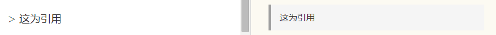

#### 9.表格

在Markdown中，插入表格是比较累人的，幸好插入表格的场景不是很多。

例子如下：

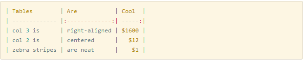

显示的效果：

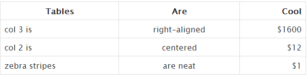

## 三、总结

学到这里，Markdown的基本语法你已经掌握了，只需多加练习，配合好的工具，想必在以后的写作中必定会行云流水。你一定会爱上这简洁又强大的语言。

>  -------------------------  by  CDP