# 一、开始使用收藏夹

收藏夹会使你的工作效率更上一层楼

收藏夹可以让单个的request分组在一起，这些request可以被进一步的管理到文件夹来更准确的反应你的API。request也可以在保存到收藏夹时存储response例子。你也可以给你的request增加名称或相关描述，使得开发者可以更轻松的使用你的API。

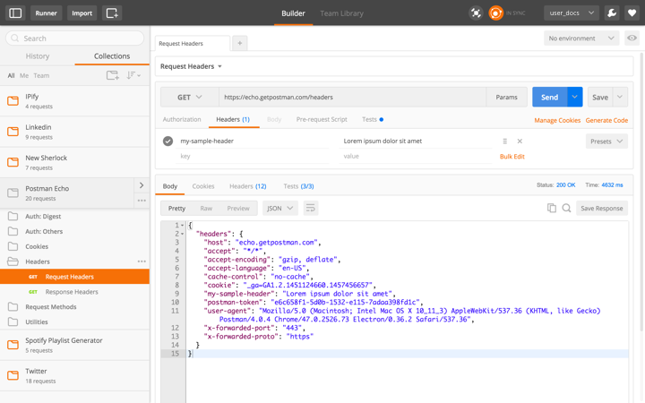

## 1.创建一个收藏夹
***

单击收藏夹侧边栏标签下面的**new collection**按钮来创建一个新的收藏夹。

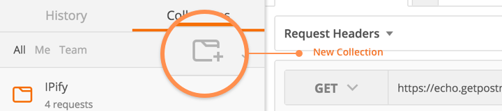

在弹出的对话框中输入收藏夹的名称和描述然后点击**Create**按钮创建

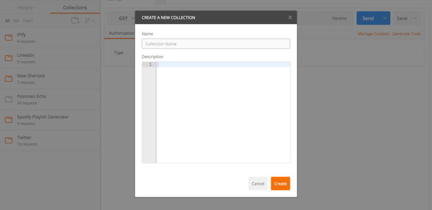

## 2.收藏夹操作
***
+ #### Edit

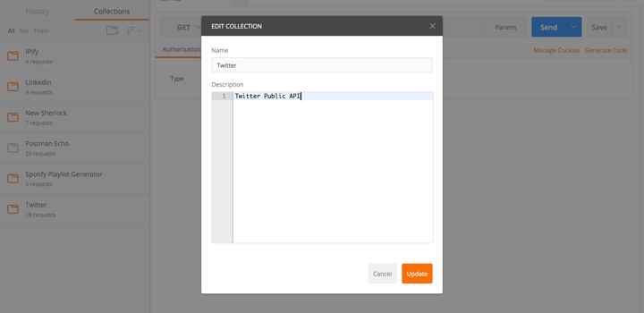

在这里可以更改收藏夹的名称和对收藏夹添加描述信息。

+ #### Share

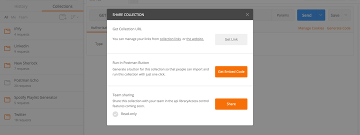

收藏夹可以当做JSON文件下载，这允许你可以和其让人分享你的Postman内容。你可以以匿名的身份分享你的收藏夹但是建议你当你上传一个收藏夹时创建一个Postman的账户，以便更新你的收藏夹，你也可以公开它或者删除它。

如果你是一个使用Postman Cloud的团队中的一员，你可以分享你的收藏夹到整个团队或者只分享这个收藏夹的一部分。

+ #### Delete

删除一个收藏夹会同时删除这个收藏夹本地的分备份。但是不会删除你通过getpostman.com分享的收藏夹。

+ #### Add Folder

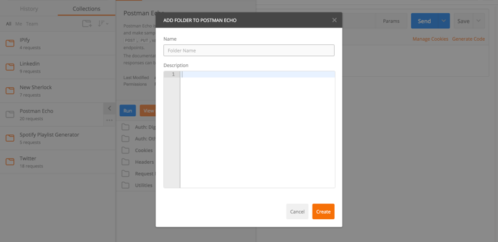

文件夹是收藏夹的子集。你可以在一个收藏夹中创建很多文件夹。你可以直接添加一个request到一个文件夹里。文件夹同时也支持Markdown-based描述

现在你只能在收藏夹下面拥有一级文件夹。

+ #### Saving requests inside a collection

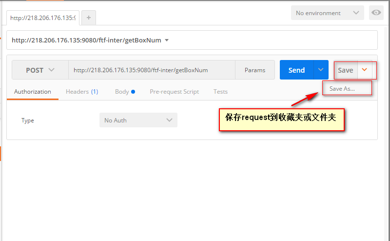

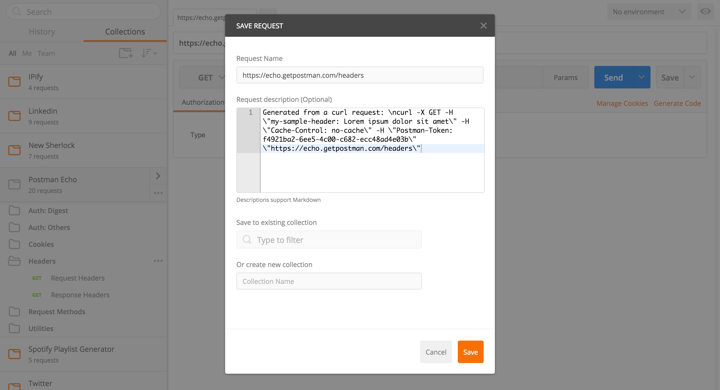

在这里你可以添加相关的Request描述，指定保存到的收藏夹或文件夹。

点击**Save**按钮保存request到收藏夹。

注意：表单格式的request和二进制格式的request中包含的文件是不会被保存的收藏夹的。这是由于HTML5规范的限制。

+ #### Searching

你可以用侧边栏的搜索框来搜索收藏夹、文件夹、request等。

## 3.文件夹、request的选项
***
+ #### Editing

在这里你可以在这里编辑名称和描述，描述支持Markdown

+ #### Duplicating

这会创建一个文件夹或request的拷贝。新的文件夹或request会被创建为原来的同级。

+ #### Deleting

删除文件夹会删除里面的request。删除request会删除其保存的所有的response。

# 二、收藏夹浏览框

收藏夹浏览框帮助你在Postman界面里浏览收藏夹的原始数据信息。

点击 **Expand** 按钮打开收藏夹的浏览框

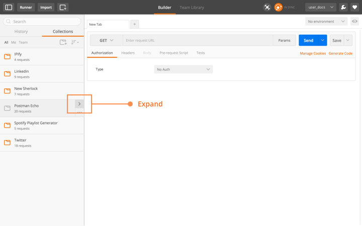

这里你可以浏览整个收藏夹信息，也可以打开里面的request。收藏夹浏览框可以让你进行一些常规的操作，由于Postman可以导入Swagger、WADL、RAML的文档，你可以管理这些API，这会让你的开发更容易。

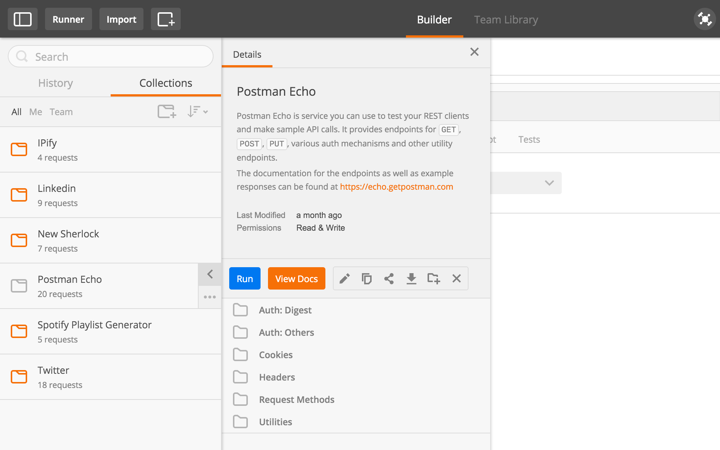

# 三、分享你的收藏夹

你可以在你的团队里分享你的收藏夹，你可能需要确保你的团队是在线的，你可以在你的团队页面看到一些计划的细节。如果你也在线，你可以点击**Share**按钮分享你的收藏夹

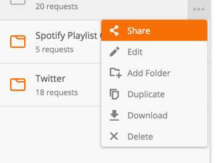

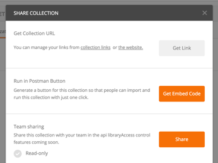

在收藏夹分享对话框里，你可以选择分享的方式为只读，这意味着订阅他的用户不能对他进行编辑。

一个团队分享的收藏夹可以在团队文库里查看。在这里你可以订阅他人分享的收藏夹。

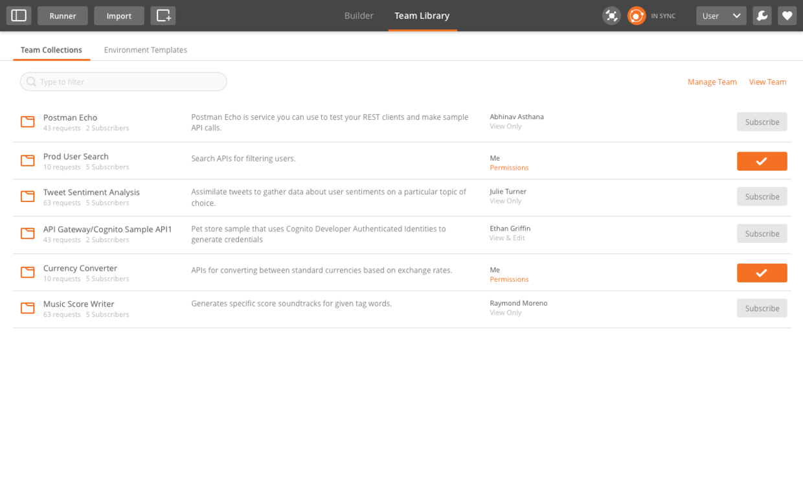

# 四、运行收藏夹

点击运行按钮，你可以运行你的收藏夹。如果需要你可以运行它数千次。

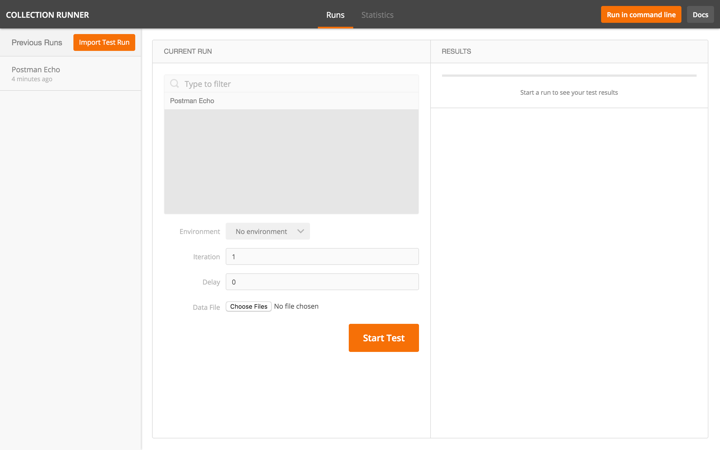

收藏夹的运行按钮会按收藏夹内request的顺序依次运行他们。他同样也运行每个request的test，同时会生成运行的情况的概述，你可以比较他们并查看他们的不同。

你需要做的就是选择一个收藏夹和所需的环境，通常来说你可以添加一个CSV或者JSON文件，使得Postman可以从中取得数据。

收藏夹的运行窗口是独立于Postman的主窗口来运行的。你可以在主窗口里更改你的收藏夹，运行窗口也会同步更新。

## 运行窗口选项

+ **Collection/Folder**

如果收藏夹里有文件夹，文件夹里的request同样也会被执行。

+ **Environment**

选择你需要的运行环境

+ **Iterations**

你想运行 你的收藏夹的次数，这里没有一个官方的限制次数。

+ **Data** 

加载 CSV/JSON 数据文件

点击 **Start Test**按钮，Postman将会开始运行，并显示运行的解惑。一旦运行结束你可以开始新的运行或者在历史中选择运行数据

## 查看运行结果

点击运行后，会在一个新的标签页面里生成运行数据。

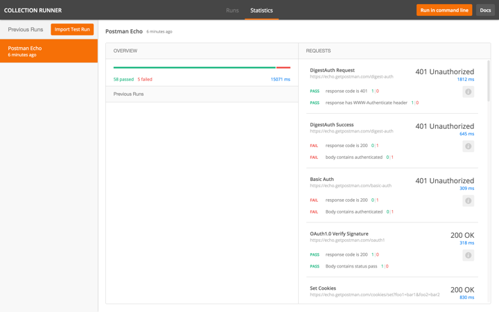

Postman显示你的运行参数，也显示了通过的测试和失败的测试个数，以及平均的响应时间。

你可以查看运行的基本统计数据，你可以比较相比以前多少测试通过了，是不是你的API设计的更好了。

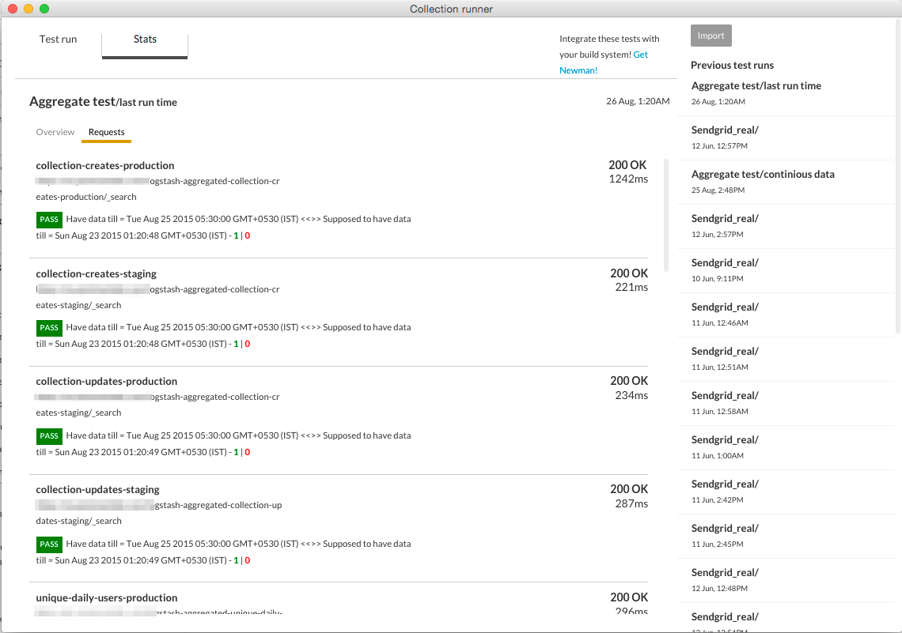

**REQUESTS** 标签显示了所有运行的request的响应时间、测试结果、最后收到的状态码。这帮助你可以快速的得到整个API的状态。如果当运行多次某个测试失败了，这个测试就会标记为失败。如果一切都运行正常，你可以看到很多绿色标记。

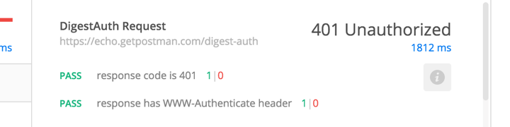

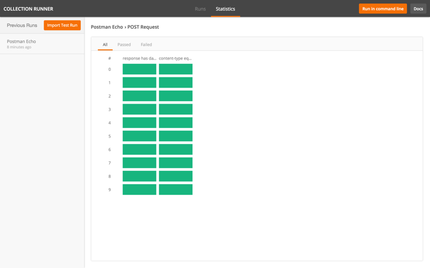

### Postman 使用手册系列教程：
***
[Postman软件安装](http://www.jianshu.com/p/2bd4cca94185)
[Postman使用手册1——导入导出和发送请求查看响应](http://www.jianshu.com/p/13c8017bb5c8)
[Postman使用手册2——管理收藏](http://www.jianshu.com/p/19c473995a80)
[Postman使用手册3——环境变量](http://www.jianshu.com/p/bffbc79b43f6)
[Postman使用手册4——API test](http://www.jianshu.com/p/61cfcb436ee4)