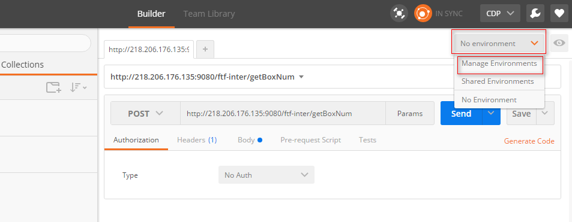
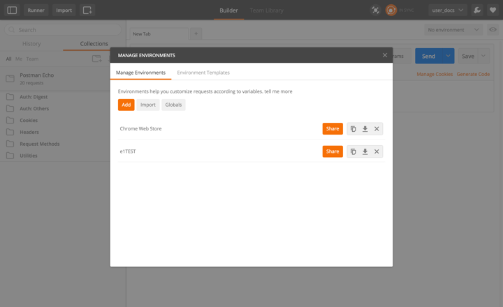
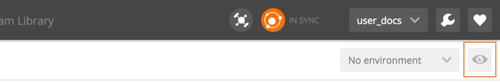
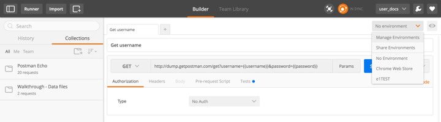
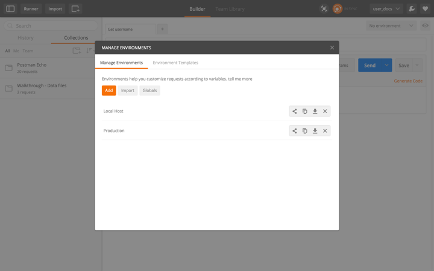
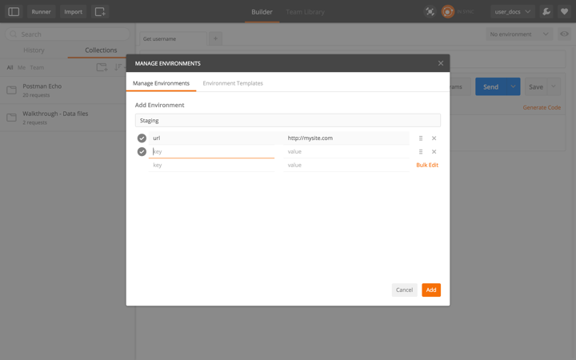
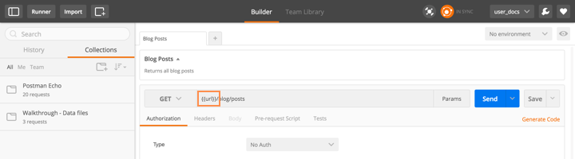

# 一、环境变量

当使用API的时候，你可能经常需要使用不同的设置。环境设置可以让你使用变量自定义request。这个方法可以让你轻松的在不同的设置之间改变而不用改变你的request。你不需要担心要记住Postman中所有的这些变量的值。环境可以下载保存为JSON文件，以后可以再加载他。

环境变量被设置为键值对，键为变量的名字。

变量可以以这个形式使用： {{variableName}}，这个字符串{{variableName}} 将会被他的值所替代。例如：环境变量名为 'url'，值为 'http://localhost' ，你可以在request的URL字段中使用{{url}}，{{url}}将会在request发送时被替换成 'http://localhost'。

只有当前环境中的变量才是有效的。使用环境变量选择器选择一个环境

环境变量可以帮助你分离敏感数据例如keys和passwords。你最好保存所有的敏感值到一个环境中，提供一个虚拟的环境来使用。如果你信任这个用户，你也可以给他你的环境。

警告：环境和全局变量被存储为字符串。如果你正在存储对象或数组，请确保在存储前使用JSON.stringify()格式化他们 ，在检索时使用 JSON.parse()。

# 二、全局变量

全局变量提供了一组总是有效的变量。你可以有很多环境变量，但是同一时间只能有一组有效。但是你可以像使用环境变量一样使用全局变量。

如果一个有效的环境变量名和全局变量名重名，那么全局变量名将被环境变量名覆盖。

# 三、设置环境变量

在不同的环境中测试request

#### 1.Create an environment
 

+ 点击**No environment**按钮

+ 选择 **Manage environments**，点击**Add**按钮。

+ 填写变量名和变量值

+ 提交

#### 2.创建你将要测试使用的环境
 

我们可以duplicata（复制）我们刚创建的环境，这样我们就不必再填写一次了。

#### 3. 在request中使用环境变量
 

环境变量可以使用在以下地方：

+ URL
+ URL params
+ Header values
+ form-data/url-encoded values
+ Raw body content
+ Helper fields

在你要使用的变量名上附上双花括号。

#### 4.选择要使用的环境
 

当我们选择了环境之后，Postman将会用变量的值替代所有的变量。如果没有选择环境，Postman将会在全局变量中寻找对应的变量。

#### 5.发送request
 

#### 6.改变环境，再次发送request。
 

#### 7.重复上述步骤直到所有的环境都被测试。
 

### Postman 使用手册系列教程：
 
[Postman软件安装](http://www.jianshu.com/p/2bd4cca94185)
[Postman使用手册1——导入导出和发送请求查看响应](http://www.jianshu.com/p/13c8017bb5c8)
[Postman使用手册2——管理收藏](http://www.jianshu.com/p/19c473995a80)
[Postman使用手册3——环境变量](http://www.jianshu.com/p/bffbc79b43f6)
[Postman使用手册4——API test](http://www.jianshu.com/p/61cfcb436ee4)