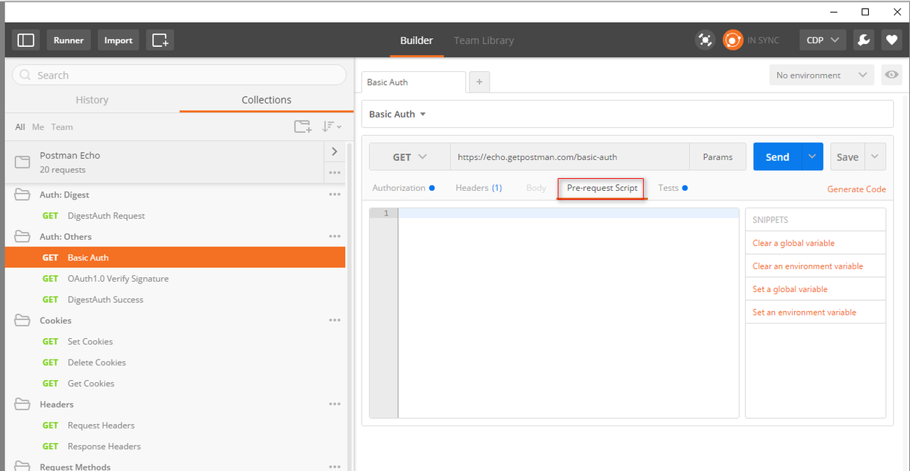
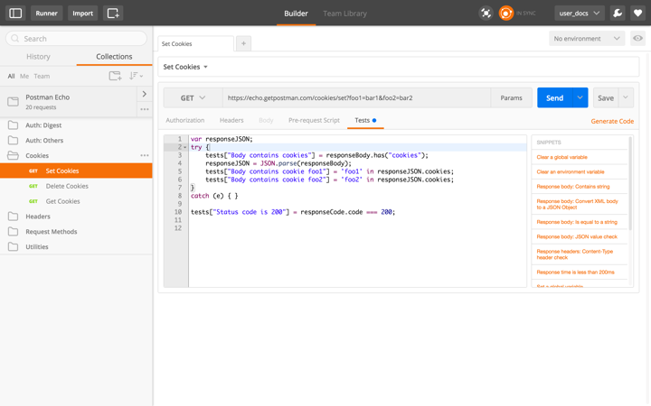
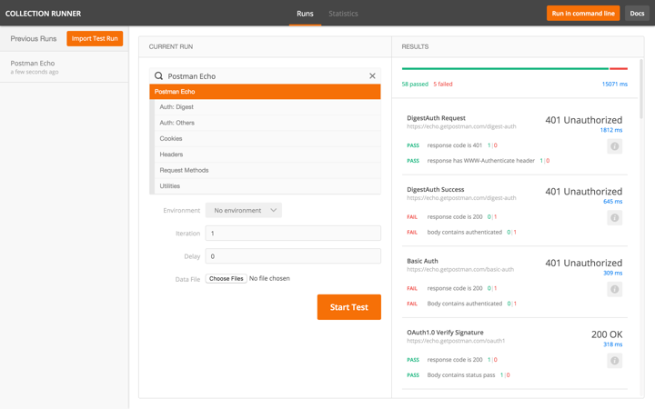

# 一、Pre Request Scripts

Postman v0.10+ 版本支持pre-request scripts。

pre-request scripts是一个关联了收藏夹内request，并且在发送request之前执行的代码片段。这对于在request header中包含时间戳或者在URL参数中发送一个随机字符串都是非常有用的。

例如：如果要在request的header中包含一个时间戳，你可以设置一个环境变量由一个函数返回他的值。

    postman.setEnvironmentVariable('timestampHeader',new Date());

你可以在header中使 **timestampHeader** 变量，当request发送的时候，你的pre-request script将被执行，这个timestampHeader 变量的值将会替换{{timestampHeader}}。

注意：我们设置的环境对使用的环境变量必须是有效的。

# 二、Writing Tests

## 1.基本结构
 

![Uploading prerequest script_871640.png . . .]

Postman给了你一个环境让你能够为每个request编写、执行你的test，而不用担心任何额外的设置。

一个Postman的test本质上是JavaScript的代码可以用来为一些特殊的test设置值。你可以在对象中设置一个描述性的键作为一个元素，然后声明他如果是true或false。

    tests[“Body contains user_id”] = responseBody.has(“user_id”) 

这回核对body中是否包含了user_id这个字符串。如果你需要，你可以增加更多的键，这取决于你要用test做多少的事情。

test被保存为收藏夹request的一部分，这对于后端或前端的工程师来确保API运行的正常都是非常有意义的。

## 2.SNIPPETS
 

在写test的时候这里有些事情需要注意，Postman尝试使得列出常用的片段更简单。你可以选择你想添加的片段，然后适当的代码将被添加到test的编辑器中。这是一个很好的方法来快速的构建test

## 3.查看结果
 

Postman在你执行一个request的时候执行test，当然你可以选择不考虑test。结果被显示在一个tab里，并在头部显示多少test通过了测试。你设置在test中的变量将会被列在这里。如果值是true，这个test就会通过。你可以保持test tab活动直到你确保所有的test执行完。

# 三、Testing Sandbox

Postman的sandbox是一个JavaScript的执行环境，这使得你能够为request写pre-request scripts和test scripts 。不论你写的代码是pre-request scripts还是test script都会在sandbox中执行。

## 1.常用的库和工具
 

+ **[Lodash](https://lodash.com/)**：
JS utility library

+ **[jQuery](https://jquery.com/)** (Deprecated): 
Cross-platform JavaScript library. This will be removed in future versions of the sandbox.

+ **[BackboneJS](http://backbonejs.org/)** (Deprecated): 
Provides simple models, views, and collections. This will be removed in future versions of the sandbox.

+ **[SugarJS](http://sugarjs.com/)**: 
Extends native JS objects with useful methods

+ **[tv4 JSON schema validator](https://github.com/geraintluff/tv4)**: 
Validates JSON objects against v4 of the json-schema draft

+ **[CryptoJS](https://code.google.com/p/crypto-js/)**: 
standard and secure cryptographic algorithms. Supported algorithms: AES, DES, EvpKDF, HMAC-MD5, HMAC-SHA1/3/256/512, MD5, PBKDF2, Rabbit, SHA1/3/224/256/512, TripleDES

+ **`xml2Json(xmlString)`**: 
This function behaves the same in Newman and Postman

+ **`xmlToJson(xmlString)`**(Deprecated): 
This function does NOT behave the same in Newman and Postman

+ **`postman.getResponseHeader(headerName)`** (Test-only):
 returns the response header with name "headerName", if it exists. Returns null if no such header exists. Note: According to W3C specifications, header names are case-insensitive. This method takes care of this.
postman.getResponseHeader("Content-type") and postman.getResponseHeader("content-Type") will return the same value.

## 2.环境和全局变量

+ **`postman.setEnvironmentVariable(variableName, variableValue)`** : Sets an environment variable "variableName", and assigns the string "variableValue" to it. You must have an environment selected for this method to work. Note: Only strings can be stored. Storing other types of data will result in unexpected behavior.

+ **`postman.setGlobalVariable(variableName, variableValue)`**: 
Sets a global variable "variableName", and assigns the string "variableValue" to it. Note: Only strings can be stored. Storing other types of data will result in unexpected behavior.

+ **`postman.clearEnvironmentVariable(variableName)`**:
 Clears the environment variable named "variableName". You must have an environment selected for this method to work.

+ **`postman.clearGlobalVariable(variableName)`**:
 Clears the global variable named "variableName".

+ **`postman.clearEnvironmentVariables()`**:
Clears all environment variables. You must have an environment selected for this method to work.

+ **`postman.clearGlobalVariables()`**: 
Clears all global variables.

+ **`environment`**:
 A dictionary of variables in the current environment. Use environment["foo"]
 to access the value of the "foo" environment variable.

+ **`globals`**:
 A dictionary of global variables. Useglobals["bar"]
 to access the value of the "bar" global variable.

## 3.动态变量

Postman也有一些动态变量，你可以用在你的request中。这个现在主要还是在实现阶段，更多的功能以后被被添加进来。注意：动态变量不可以用于SandBox中，你只能在request的URL、headers、body中以放在双花括号中间的形式使用。

+ {{$guid}}: Adds a v4 style guid

+ {{$timestamp}}: Adds the current timestamp.

+ {{$randomInt}}: Adds a random integer between 0 and 1000

## 4. Cookies

+** responseCookies {array} **（Postman-only）: 
Gets all cookies set for the domain. You will need to enable the [Interceptor](http://www.getpostman.com/docs/capture#interceptor) for this to work.

+ **postman.getResponseCookie(cookieName)**（Postman-only）:
 Gets the response cookie with the given name. You will need to enable the interceptor for this to work. Check out the [blog post](http://blog.getpostman.com/index.php/2014/11/28/using-the-interceptor-to-read-and-write-cookies/).

## 5.Request/response相关属性

+ **request {object}**:
 Postman makes the request object available to you while writing scripts. This object is read-only. Changing properties of this object will have no effect. Note: Variables will NOT be resolved in the request object. The request object is composed of the following:
    + **data {object}**:
this is a dictionary of form data for the request. (request.data["key"]=="value")

    + **headers {object}**:
this is a dictionary of headers for the request (request.headers["key"]=="value")

    + **method {string}**:
GET/POST/PUT etc.

    + **url {string}**:
the url for the request.

+ **responseHeaders {object}**(Test-only)(Deprecated): 
This is a map of the response headers. This is case-sensitive, and should not be used. Check thepostman.getResponseHeader()
 method listed above.

+ **responseBody {string}**(Test-only):
 A string containing the raw response body text. You can use this as an input to JSON.parse, or xml2Json.

+ **responseTime {number}**(Test-only):
 The response time in milliseconds

+ **responseCode {object}**(Test-only):
 Contains three properties:
    
  + **code {number}**:
The response code (200 for OK, 404 for Not Found etc)
  
  + **name {string}**:
 The status code text

  + **detail {string}**:
 An explanation of the response code

+ **tests {object}**(Test-only): 
This object is for you to populate. Postman will treat each property of this object as a boolean test.

+ **iteration {number}**:
 Only available in the Collection Runner and Newman. Represents the current test run index. Starts from 0.

(Test-only): This object is only available in the test script section. Using this in a pre-request script will throw an error.

# 四、Testing 实例

我们来看一些Postman用于test的例子。这些例子中的大多数在Postman中是有效的，他们像一行JavaScript语句一样简答。在你的request中你可以有很多的test。

注意：test脚本在从服务器收到response后执行

#### 1.设置环境变量：

    postman.setEnvironmentVariable("key", "value");

#### 2.设置全局变量：

     postman.setGlobalVariable("key", "value"); 

#### 3.检查response的body中是否包含字符串：

    tests["Body matches string"] = responseBody.has("string_you_want_to_search");

#### 4.把XML的body转换成JSON对象：

    var jsonObject = xml2Json(responseBody);

#### 5.检查response的body是都为一个字符串：

    tests["Body is correct"] = responseBody === "response_body_string";

#### 6.检查JSON的值：

    var data = JSON.parse(responseBody);
    tests["Your test name"] = data.value === 100;

#### 7.内容类型存在（检查不区分大小写）

    tests["Content-Type is present"] = postman.getResponseHeader("Content-Type"); //Note: the getResponseHeader() method returns the header value, if it exists.

#### 8.内容类型存在（区分大小写）：

    tests["Content-Type is present"] = responseHeaders.hasOwnProperty("Content-Type");

#### 9.response的响应时间小于200ms：

    tests["Response time is less than 200ms"] = responseTime < 200;

#### 10.状态码为200：

    tests["Status code is 200"] = responseCode.code === 200;

#### 11.Code name contains a string：

    tests["Status code name has string"] = responseCode.name.has("Created");

#### 12.成功的POST request状态码：

    tests["Successful POST request"] = responseCode.code === 201 || responseCode.code === 202;

#### 13.Use TinyValidator for JSON data

    var schema = {
        "items": {
         "type": "boolean"
         }
    };
    var data1 = [true, false];
    var data2 = [true, 123];

    console.log(tv4.error);
    tests["Valid Data1"] = tv4.validate(data1, schema);
    tests["Valid Data2"] = tv4.validate(data2, schema);

#### 14.Sample data files

JSON files are composed of key/value pairs：

[Download JSON file](http://www.getpostman.com/samples/test_data_file.json)

For CSV files, the top row needs to contain variable names

[Download CSV file](http://www.getpostman.com/samples/test_data_file.csv)

### Postman 使用手册系列教程：
 
[Postman软件安装](http://www.jianshu.com/p/2bd4cca94185)
[Postman使用手册1——导入导出和发送请求查看响应](http://www.jianshu.com/p/13c8017bb5c8)
[Postman使用手册2——管理收藏](http://www.jianshu.com/p/19c473995a80)
[Postman使用手册3——环境变量](http://www.jianshu.com/p/bffbc79b43f6)
[Postman使用手册4——API test](http://www.jianshu.com/p/61cfcb436ee4)