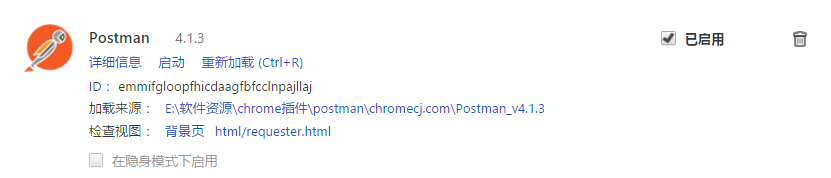
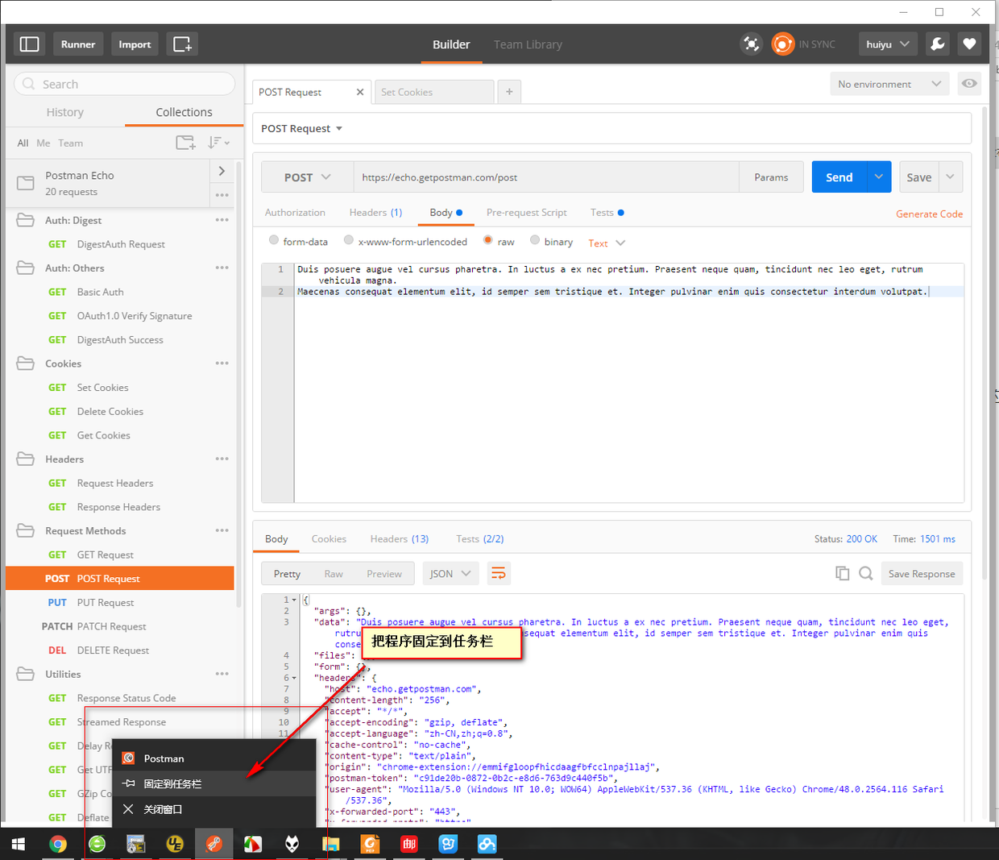

我的Postman是安装在Chrome浏览器上的：

启动时候直接点启动就可以，如果用户怕麻烦每次都要在Chrome的扩展程序中启动，可以在软件启动后，把软件固定到任务栏：

关于软件资源你可以在[Postman的官网](https://www.getpostman.com)根据自己的开发环境选择最新的软件版本，如果大家的网速不好又想安装Chrome版的话，可以试用我发布的资源

这是百度网盘分享的Postman安装包，找不到资源的用户可以试用：
[Postman安装包](http://pan.baidu.com/s/1mhKaVFy)

Chrome插件的安装方法，可以参见我的另一篇文章：
[如何在谷歌浏览器中安装.crx扩展名的离线Chrome插件？](http://www.jianshu.com/p/12ca04c61fc6)

如果你下载了我发布的软件包，解压软件后，直接在Chrome中加载已解压的扩展程序便可。