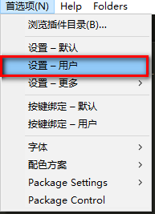
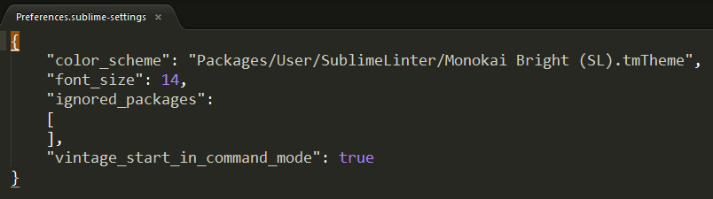
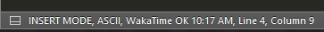
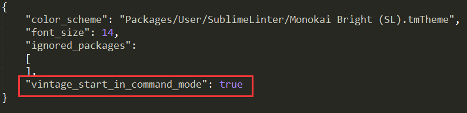

# 一、 Vintage模式 概述
 
Vintage是Sublime Text的vi模式编辑包。 可以使用组合vi命令来调用Sublime Text的功能，包括多重选择。

Vintage模式是开放开发的，而且非常欢迎进行完善和扩展。如果你愿意做点贡献的话，可以在GitHub页面上找到更多细节。

 
 

# 二、  启用Vintage
 

Vintage默认是禁用的， 通过 ignored_packages 配置。如果要从ignored packages列表中移除"Vintage"的话可以通过下面的方式编辑:

## 1.  选择 Preferences/Settings - User菜单:

## 2. 编辑ignored_packages配置, 

    修改:
     "ignored_packages": ["Vintage"]
    成:
        "ignored_packages": []

然后保存文件：

Vintage模式则已启用——你可以看到"INSERT MODE"显示在状态栏了。

## 3. Vintage默认是插入模式。
可以添加:

    
    "vintage_start_in_command_mode": true

这项配置到User Settings里。

 
 

# 三、 包含哪些功能
 
Vintage包含大部分的基本命令：d (delete), y (copy), c (change), gu (lower case), gU (upper case), g~ (swap case), g? (rot13), < (unindent), and > (indent)。

同时也包含许多移动操作，包括l, h, j, k, W, w, e, E, b, B, alt+w (move by sub-words), alt+W (move backwards by sub-words), $, ^, %, 0, G, gg, f, F, t, T, ^f, ^b, H, M, and L.

文本对象的支持，包括词，引号，括号和标签。

重复点号('.')也是支持的， 用于重复指定次数的命令和移动。寄存器也是支持的，有宏命令和书签。许多其它混合命令也支持，比如*, /, n, N, s, S 等等。

 
 

# 四、 那些没有
 
插入模式时常规的Sublime Text编辑模式，绑定的是Sublime Text常用的快捷键：并没有模仿vi 插入模式的键盘绑定。

通过via命令面板执行的Ex commands没有实现，除了:w和:e。

Under the Hood

Vintage模式完全是参考via键盘绑定和基于插件API来实现的——你可以自由的浏览Vintage包，看看它们是如何组合在一起的。举个例子，如果你要把 "jj" 绑定为退出插入模式，你可以像下面这样天剑键盘绑定：

    { "keys": ["j", "j"], "command": "exit_insert_mode",
        "context":
        [
            { "key": "setting.command_mode", "operand": false },
            { "key": "setting.is_widget", "operand": false }
        ]
    }

 
 
