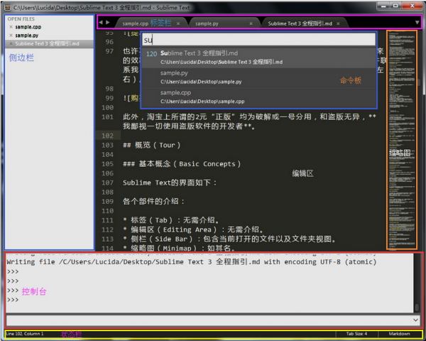

# 一、 基本概念
 

Sublime Text的  界面 如下：

+ 标签（Tab）：无需介绍。
+ 编辑区（Editing Area）：无需介绍。
+ 侧栏（Side Bar）：包含当前打开的文件以及文件夹视图。
+ 缩略图（Minimap）：如其名。
+ 命令板（Command Palette）：Sublime Text的操作中心，它使得我们基本可以脱离鼠标和菜单栏进行操作。
+ 控制台（Console）：使用Ctrl + `调出，它既是一个标准的Python REPL，也可以直接对Sublime Text进行配置。
+ 状态栏（Status Bar）：显示当前行号、当前语言和Tab格式等信息。

 
 

# 二、 配置（Settings）
 

与其他GUI环境下的编辑器不同，Sublime Text并没有一个专门的配置界面，与之相反，Sublime Text使用JSON配置文件，例如：
   

    1. { 
    2.   "font_size": 12, 
    3.   "highlight_line": true, 
    4. } 

会将默认字体大小调整为12，并高亮当前行。
JSON配置文件的引入简化了Sublime Text的界面，但也使得配置变的复杂，一般我会到[这里](http://sublime-text-unofficial-documentation.readthedocs.io/en/latest/reference/settings.html)查看可用的Sublime Text配置。
