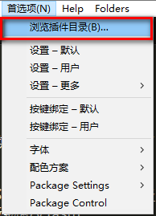
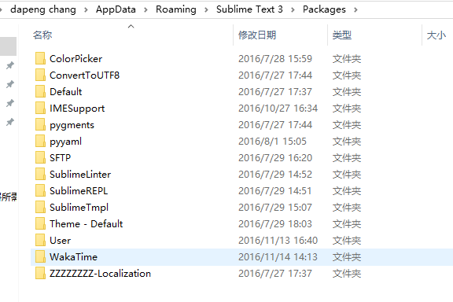
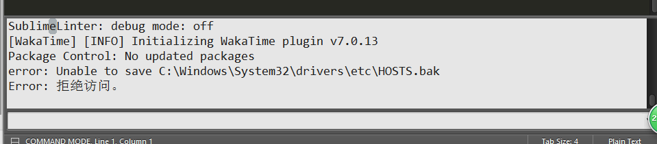
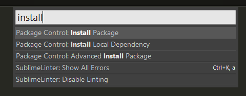
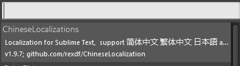
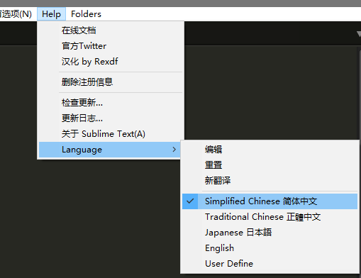

# 一、插件安装方式
 
Sublime Text的强大就是她拥有强大的课可扩展性。您可根据自己的需要安装不同的插件；这使得她  变的无比强大的同时又不失轻便。

## 1. 插件安装方式一：直接安装

安装Sublime text 3插件很方便，可以直接下载安装包解压缩到Packages目录（菜单->preferences->packages）。

 

## 2. 插件安装方式二：使用Package Control组件安装

按下 Ctrl+Shift+P 调出命令面板输入 install 调出 Install Package 选项并回车，然后在列表中选中要安装的插件。

国内使用SublimeText3，经常可能遇到无法安装可用插件问题，可remove掉Package Control重新安装下；如遇到连Package Control也无法安装，则可以在别处拷贝一份关于Package Control的文件－(Package Control.sublime-package)存放于Installed Packages目录之下即可。

 
 

# 二、 安装Package Contorl 
 

最简单的安装方法是通过sublime text 的控制台，我们使用 [ctrl + ' ` '(tab键上面的反引号键)] 快捷键打开控制台。

然后你可以通过在控制台中复制下面的代码来安装 sublime text 的 package control，也可以按照 [官网这里](https://packagecontrol.io/installation) 复制命令。

    import urllib.request,os,hashlib; h = 'eb2297e1a458f27d836c04bb0cbaf282' + 'd0e7a3098092775ccb37ca9d6b2e4b7d'; pf = 'Package Control.sublime-package'; ipp = sublime.installed_packages_path(); urllib.request.install_opener( urllib.request.build_opener( urllib.request.ProxyHandler()) ); by = urllib.request.urlopen( 'http://packagecontrol.io/' + pf.replace(' ', '%20')).read(); dh = hashlib.sha256(by).hexdigest(); print('Error validating download (got %s instead of %s), please try manual install' % (dh, h)) if dh != h else open(os.path.join( ipp, pf), 'wb' ).write(by)

等待报一个出错弹出窗口，点击确认，然后关闭并重启Sublime Text，此时Package Control就装好了。

 
 

# 三、  通过 Package Control  安装汉化包
 
点击Preferences/Package Control，然后点击Package Control：Install Package,或者使用 [Ctrl + Shift + p] 快捷键打开package control ，输入install，就会自动 匹配出Package Control：Install Package功能。

第一次运行可以要几秒钟，因为要下载Package Control里面存在的包"花名册"，然后在弹出的命令界面，输入Chinese，选择 ChineseLocalization (回车或者鼠标单击击)。

切换语言，帮助(H)/Language/简体中文，繁体中文，日本语，English。

 
 

# 四、 解决中文输入法输入框不跟随问题
 
从Sublime Text的初版（1.0）到现在（3.0 3065），中文输入法（包括日文输入法）都有一个问题：输入框不跟随。
目前官方还没有修复这个bug，解决方法是安装 IMESupport 插件，之后重启Sublime Text问题就解决了。
