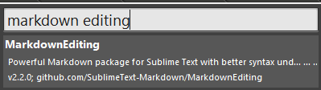
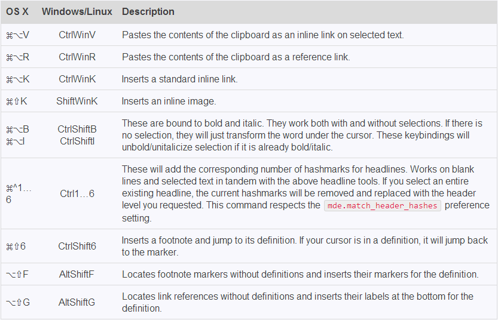

# 一、 MarkdownEditing 插件简介
 
Github项目地址：SublimeText-Markdown/MarkdownEditing

MarkdownEditing 从视觉和便捷性上针对 Markdown 文档的编辑进行了一系列的优化。具体如下(Mac下)：

+ 安装后针对 md\mdown\mmd\txt 格式文件启用插件。颜色方案仿 Byword及iA writer。
+ 自动匹配星号（*）、下划线（_）及反引号（`），选中文本按下以上符号能自动在所选文本前后添加配对的符号，方便粗体、斜体和代码框的输入。
+ 直接输入配对的符号后按下退格键（backspace），则两个符号都会被删除；直接输入配对的符号后按下空格键，则会自动删除后一个。
+ 对“选中文字后输入左括号”这一动作进行了调整，以便插入markdown链接。
+ 拷贝一个链接，选中文本后按下 ⌘⌥V 会自动插入内联链接。
+ 拷贝一个链接，选中文本后按下 ⌘⌥R 会自动插入引用链接。
+ ⌘⌥K 插入链接；⌘⇧K 插入图片。
+ ⌘⇧B 和 ⌘⇧I 分别用于加粗体和斜体。
+ ⌘^1..6 对于选中的内容前加对应个数#,即对选中内容字体大小设置为h1~h6;
+ ⌘⇧6插入文档脚注并且跳转到它的定义；具体可参见:Footnotes;
+ 选中文本后按下 # 会自动在文本前后进行配对，可重复按下来定义标题级别。

 
 

# 二、 安装
 
如果Sublime安装了Package Control,直接 Ctrl+Shift+P 输入MarkdownEditing，搜索到点击即可自行安装，重启便可使用。

 
 

# 三、 使用和配置
 

有些快捷键可能与系统的一些发生冲突，可以编辑 ~/Library/Application Support/Sublime Text/Packages/MarkdownEditing/Default (OSX).sublime-keymap 改掉。

另外还有一些设置可以在 ~/Library/Application Support/Sublime Text 2/Packages/MarkdownEditing/Markdown.sublime-settings 中进行修改。

比如除了默认的颜色主题外，MarkdownEditing 还提供了一个高亮显示编辑行 MarkdownEditor-Focus，就可以在 Markdown.sublime-settings 这个文件中找到并去掉注释保存生效。

 
 

# 四、快捷键
 
无快捷键的编写，即便是Markdown也略显蛋疼。特性中已经对快捷编写有了说明；下面是MarkdownEditing官方给出的三大平台默认Key Bindings说明与对比：

