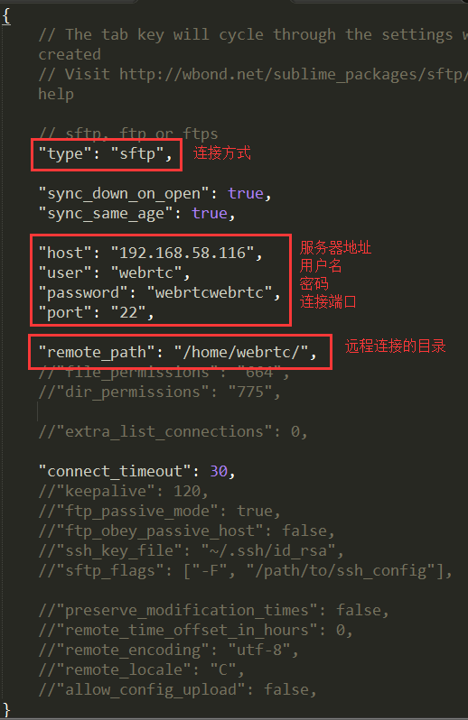
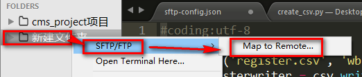

# 一、 SFTP简介
 
在Win下用Xftp 和 WinScp，被这种需要切换点击or F5刷新的手动操作蛋疼到无语；故此一遇见这SFTP，顿觉这世界都美好了许多。当然Sublime下面也有些其他同步插件，比如FtpSnyc，但是配置起来的错误提示一点都不人性化，就毫不留情的舍弃了。Sublime下有SFTP，只要Ctrl+S即可同步本地到服务器，妥妥的爽歪歪有么有？
它主要功能就是通过 FTP/SFTP 连接远程服务器并获取文件列表，可以选择下载编辑、重命名、删除等等操作，点下载编辑之后，可以打开这个文件进行修改。修改完成之后，保存一下会自动上传到远程的服务器上面。
使用这个插件之后，工作流程就变成了：使用 SFTP 插件打开文件 -> 使用 ST2 编辑修改文件 -> 保存文件 -> 刷新页面。效率提升了至少一倍以上，下面就来介绍一下具体的使用方法。

#### Sublime SFTP主要有两种工作方式：
1. Server：连接远端服务器，访问远端服务器上的文件。一般用来修改远端服务器上的一些文件
2. Remote：映射本地文件夹到远端的文件夹，既可以用来上传我们本地的文件夹到远端的服务器上，也可以把远端服务器上的整个文件夹download的我们指定的文件夹中。

 
 

# 二、 安装
 

 
 

# 三、 使用
 

## 1. 连接远端服务器（Server）
 
安装完插件之后，重启sublime text 就可以在 “文件” 菜单，找到 “SFTP/FTP” 选项，点击配置：

点击之后，会弹出一个新的窗口，这是一个配置文件

一般就是配置一下我箭头所指的六个参数，包括连接方式、服务器地址、用户名、密码、端口等。如果你的服务器还有其他配置，你也可以对照注释设置一下。还会设置一下“路径”，
存储配置文件在 Packages/User/sftp_servers 文件夹内，文件名用于在服务器列表中显示，所以文件名中不能包含空格。
配置完成之后，我们保存，然后输入一个名字作为标识。

点击 “文件” 选择 “SFTP/FTP” 中的查看服务器列表

找到我们设置的服务器

这时候点击一个文件，就可以弹出一些选项

就可以根据你自己的需要，对文件编辑、重命名什么的了。点击编辑之后，会在本地打开，然后可以修改。摁下 ctrl + s 保存文件的时候，就会自动上传文件。
如果需要查看服务器上的别的文件，或者需要更多的功能，可以直接在当前文件中右击，选择 “SFTP/FTP” 就会弹出更多选项可以使用，没法截图所以不再赘述。更多的功能，就交给你自己探索了！

 
 

## 2. remote
 

和远端同步能只存在于侧边栏中的文件夹的右键菜单中。也就是说我们如果要使用    远程的同步功能，就必须把我们要操作的文件夹加入到sublime text的侧边栏中。
配置信息存储在一个命名为sftp-config.json的文件中，存储着配置文件的文件夹可以被映射到配置文件中remote_path参数指定的远端的制定路径。

右键打开侧边栏文件夹的菜单，选择 Map to Remote

然后就会在这个文件夹中创建一个名为 sftp-config.json 的新文件，这个文件包含了到远端的配置信息。

按照下图的说明配置相关的参数：

当我们保存了配置文件的信息，我们操作的文件夹的右键菜单中就会增加一些新的功能选项：

在这些选项中，我们就可以把我们的文件夹中的文件同步到远端指定服务器的制定目录，或者将远端指定服务器的制定目录中的内容拉取到我们的文件夹中进行编辑。

 
 

# 四、 一些绑定的快捷键
 

Remote Workflow

Upload File
Win/Linux: ctrl+alt+u+f
OS X: ctrl+cmd+u+f
Upload the current file

Upload Changed Files
Win/Linux: ctrl+alt+u+c
OS X: ctrl+cmd+u+c
Upload all files changed or created since the last commit to your VCS (SVN, Git or Hg)

Upload Open Files
Win/Linux: ctrl+alt+u+n
OS X: ctrl+cmd+u+n
Upload all open files that are configured with an SFTP/FTP remote

Download File
Win/Linux: ctrl+alt+u+o
OS X: ctrl+cmd+u+o
Download the remote version of the selected file and overwrite the local copy

Upload Folder
Win/Linux: ctrl+alt+u+r
OS X: ctrl+cmd+u+r
Uploading the entire folder the current file is located in can be accomplished by pressing ctrl+alt+u+r on Windows and Linux, or ctrl+cmd+u+r on OS X.

Download Folder
Win/Linux: ctrl+alt+u+e
OS X: ctrl+cmd+u+e
Download the entire folder

Diff Remote File
Win/Linux: ctrl+alt+u+i
OS X: ctrl+cmd+u+i
Download the remote version of a file to a temp location and diff it with the local version

Rename Local and Remote Files
Context menu only
Rename the file on the server as well as the local copy

Delete Remote File
Context menu only
Delete the file off of the server

Delete Local and Remote Files
Context menu only
Delete the file off of the server in addition to the local copy

Sync Local -> Remote
Win/Linux: ctrl+alt+u+y
OS X: ctrl+cmd+u+y
Compare file modification times and confirm actions before uploading the selected file or folder. This will also delete files off of the remote server that do not exist locally.

Sync Remote -> Local
Win/Linux: ctrl+alt+u+d
OS X: ctrl+cmd+u+d
Compare file modification times and confirm actions before downloading the selected file or folder. This will also delete files off of the local machine that do not exist remotely.

Sync Both Directions
Win/Linux: ctrl+alt+u+b
OS X: ctrl+cmd+u+b
Compare file modification times and confirm actions before uploading/downloading the selected file or folder. This will never delete files, and will always perform the action that causes the newest file to be present in both locations.

Monitor File
Win/Linux: ctrl+alt+u+m
OS X: ctrl+cmd+u+m
Watch the file for modifications (from Sublime or other applications). When the file modification time changes, the file will be uploaded. This was designed to be used with programs such as LiveReload and CSS compliers. The file must remain open in Sublime to be monitored. Once it is closed, monitoring stops.

Browse Remote
Win/Linux: ctrl+alt+u+w
OS X: ctrl+cmd+u+w
Open the server quick panel browser at the remote folder corresponding to the selected file or folder
Server Workflow

Setup Server
Win/Linux: ctrl+alt+r+s
OS X: ctrl+cmd+r+s
Setup a new server.

Browse Server
Win/Linux: ctrl+alt+r+b
OS X: ctrl+cmd+r+b
List the servers, with an option to setup a new one.

Last Server
Win/Linux: ctrl+alt+r+n
OS X: ctrl+cmd+r+n
Show the current directory listing for the last used server.

Edit Server
Win/Linux: ctrl+alt+r+e
OS X: ctrl+cmd+r+e
List the servers for the purpose of editing.

Delete Server
Win/Linux: ctrl+alt+r+d
OS X: ctrl+cmd+r+d
List the servers for the purpose of deletion.
Both Workflows

Show SFTP Panel
Win/Linux: ctrl+alt+u+s
OS X: ctrl+cmd+u+s
Show the SFTP activity panel

Cancel
Win/Linux: ctrl+alt+u+x
OS X: ctrl+cmd+u+x
Stop the current SFTP/FTP server activity (connection, upload or download)

 
 

# 五、 配置文件参数信息
 
具体配置信息可以参见 [官方文档说明](https://wbond.net/sublime_packages/sftp/settings#Settings)