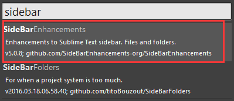

# 一、 SideBarEnhancements简介
 
SideBarEnhancements是一款很实用的右键菜单增强插件；在安装该插件前，在Sublime Text左侧FOLDERS栏中点击右键，只有寥寥几个简单的功能；安装了就相当于给其丰了大胸一般。

更强大的是，该插件还能让我们自定义快捷键呼出某个浏览器以预览页面！这样就不用到项目目录下寻找和拖动到特定浏览器中预览了。安装此插件后，点击菜单栏的preferences->package setting->side bar->Key Building-User，键入以下代码：

    [ 
    { "keys": ["ctrl+shift+c"], "command": "copy_path" },
    //chrome
    { "keys": ["f2"], "command": "side_bar_files_open_with",
    "args": {
    "paths": [],
    "application": "C:\\Users\\jeffj\\AppData\\Local\\Google\\Chrome\\Application\\chrome.exe",
    "extensions":".*"
    }
    }
    ]

这里设置按Ctrl+Shift+C复制文件路径，按F2即可在Chrome浏览器预览效果(如果需要的话，也可以根据自己的需要为Firefox，Safari，IE，Opera等加上)，当然你也可以自己定义喜欢的快捷键，最后注意代码中的浏览器路径要以自己电脑里的文件路径为准。