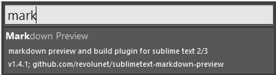
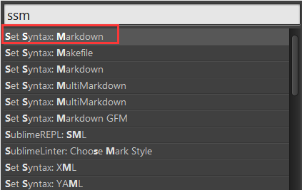
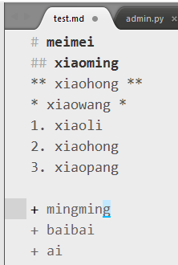
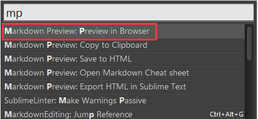
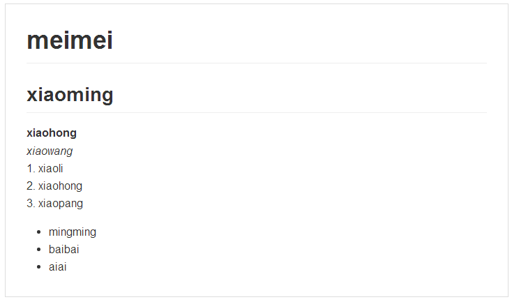

# 一、  markdown priview 插件 简介

 
 

# 二、 安装
 
按下键Ctrl+Shift+p调出命令面板，找到Package Control: install Pakage这一项。搜索 markdown preview，点击安装

 
 

# 三、配置
 
为markdown文本配置语法高亮：
按Ctrl + Shift + P
使用Markdown语法编辑文档
语法高亮，输入ssm 后回车(Set Syntax: Markdown)

 
 

# 四、 使用
 
Markdown Preview较常用的功能是preview in browser和Export HTML in Sublime Text，前者可以在浏览器看到预览效果，后者可将markdown保存为html文件。

preview in browser据称是实时的，但是实践上还是需要在st保存，然后浏览器刷新才能看到新的效果，好在markdown写得多的话也不需要每敲一行看一次效果。

按Ctrl + Shift + P 输入mp 后回车(Markdown Preview: current file in browser) 此时就可以在浏览器里看到刚才编辑的文档了; 
若设置了快捷键,直接(alt+m/..)即可.

将markdown转换为pdf应该有很多种方法的。可直接用谷歌浏览器虚拟打印功能生成。
利用Markdown Preview的Preview in Browser功能可以在浏览器上看到html效果。在页面右键->打印->另存为pdf->调节页边距即可将pdf文件下载下来。

 
 

# 五、 快捷键
st支持自定义快捷键，markdown preview默认没有快捷键，我们可以自己为preview in browser设置快捷键。
方法是在Preferences -> Key Bindings User打开的文件的中括号中添加以下代码(可在Key Bindings Default找到格式)：

    { "keys": ["alt+m"], "command": "markdown_preview", "args": { "target": "browser"} }

"alt+m"可设置为您自己喜欢的按键。
如果你这里没有看到目录而只是看到代码，说明简书不支持目录自动生成...